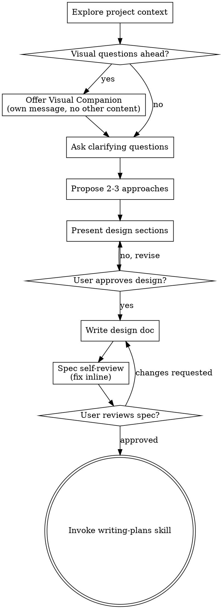

# Full Prompt History — claude-output/index.html
_Extracted from 18 Claude Code sessions that interacted with `~/ClaudeCode/claude-output/index.html`._
_Generated 2026-04-13._

---

## Session `ec00448f-a7b7-4179-b652-a720a9a069ff`
_Started: 2026-04-12T13:44:23.535Z_

### Prompt 1 — 2026-04-12T13:44:23.535Z
```
update the output html style referenced in claude.md to the style of /Users/maxdekwaasteniet/Downloads/MSP-Dashboard-BI-Market-Analysis-2026.pdf
```

### Prompt 2 — 2026-04-12T13:54:34.379Z
```
ok let's see what you can do changing the style of file:///Users/maxdekwaasteniet/ClaudeCode/claude-output/2026-04-12-tts-evaluation.html into the preferred style
```

### Prompt 3 — 2026-04-12T13:58:04.808Z
```
lovely
```

### Prompt 4 — 2026-04-12T14:08:47.695Z
```
do all claude output htmls go in the same folder or, how does that work? if can be improved feel free to suggest
```

### Prompt 5 — 2026-04-12T14:09:52.265Z
```
C is nice. build it, make sure it's backend is easy (token efficient) for claude to read
```

## Session `ebce882b-53d7-436b-b9d5-56b8c11509a3`
_Started: 2026-04-12T13:54:06.603Z_

### Prompt 1 — 2026-04-12T13:54:06.603Z
```
use koroko to generate an audiobook of chapter 1 of /Users/maxdekwaasteniet/Downloads/Kevin\ MacDonald\ -\ The\ Culture\ of\ Critique_\ An\ Evolutionary\ Analysis\ of\ Jewish\ Involvement\ in\ Twentieth-Century\ Intellectual\ and\ Political\ Movemen\ \(2002\,\ 1st\ Books\ Library\)\ -\ libgen.li.epub  so after preface, chapter called "jews and" etc
```

### Prompt 2 — 2026-04-12T13:59:18.629Z
```
Continue from where you left off.
```

### Prompt 3 — 2026-04-12T14:02:48.481Z
```
Continue from where you left off.
```

### Prompt 4 — 2026-04-12T14:05:03.477Z
```
still going?
```

### Prompt 5 — 2026-04-12T14:11:02.926Z
```
tell me progress % every minute pls
```

### Prompt 6 — 2026-04-12T14:14:01.571Z
```
Check Kokoro audiobook generation progress: `cat ~/ClaudeCode/kokoro-output/progress.log` and report the % to the user. If done (168/168 or file gone), check the output file. Keep looping every 60s until complete.
```

### Prompt 7 — 2026-04-12T14:16:00.607Z
```
Check Kokoro audiobook generation progress: `cat ~/ClaudeCode/kokoro-output/progress.log` and report the % to the user. If done (168/168 or file gone), check the output file. Keep looping every 60s until complete.
```

### Prompt 8 — 2026-04-12T14:18:00.578Z
```
Check Kokoro audiobook generation progress: `cat ~/ClaudeCode/kokoro-output/progress.log` and report the % to the user. If done (168/168 or file gone), check the output file. Keep looping every 60s until complete.
```

### Prompt 9 — 2026-04-12T14:18:52.042Z
```
continue
```

### Prompt 10 — 2026-04-12T14:20:00.288Z
```
Check Kokoro audiobook generation progress: `cat ~/ClaudeCode/kokoro-output/progress.log` and report the % to the user. If done (168/168 or file gone), check the output file. Keep looping every 60s until complete.
```

### Prompt 11 — 2026-04-12T14:22:00.359Z
```
Check Kokoro audiobook generation progress: `cat ~/ClaudeCode/kokoro-output/progress.log` and report the % to the user. If done (168/168 or file gone), check the output file. Keep looping every 60s until complete.
```

### Prompt 12 — 2026-04-12T14:24:00.863Z
```
Check Kokoro audiobook generation progress: `cat ~/ClaudeCode/kokoro-output/progress.log` and report the % to the user. If done (168/168 or file gone), check the output file. Keep looping every 60s until complete.
```

### Prompt 13 — 2026-04-12T14:26:00.150Z
```
Check Kokoro audiobook generation progress: `cat ~/ClaudeCode/kokoro-output/progress.log` and report the % to the user. If done (168/168 or file gone), check the output file. Keep looping every 60s until complete.
```

### Prompt 14 — 2026-04-12T14:28:00.637Z
```
Check Kokoro audiobook generation is fully complete: `ls -lh ~/ClaudeCode/kokoro-output/` and `tail -10 ~/ClaudeCode/kokoro-output/run.log`. If the m4a or wav file exists, report to the user and open it in Finder. Stop looping.
```

### Prompt 15 — 2026-04-12T14:31:00.079Z
```
Check Kokoro audiobook generation progress: `cat ~/ClaudeCode/kokoro-output/progress.log` and report the % to the user. If done (168/168 or file gone), check the output file size and duration, then open in Finder. Keep looping every 2min until complete.
```

### Prompt 16 — 2026-04-12T14:34:00.570Z
```
Check Kokoro audiobook generation progress: `cat ~/ClaudeCode/kokoro-output/progress.log` and report the % to the user. If done (168/168 or file gone), check the output file size and duration, then open in Finder. Keep looping every 2min until complete.
```

### Prompt 17 — 2026-04-12T14:36:00.108Z
```
Check Kokoro audiobook generation progress: `cat ~/ClaudeCode/kokoro-output/progress.log` and report the % to the user. If done (168/168 or file gone), check the output file size and duration, then open in Finder. Stop looping.
```

### Prompt 18 — 2026-04-12T15:58:32.545Z
```
can it do it in a different voice? can i pick a voice if it has enough of an audio historY?
```

### Prompt 19 — 2026-04-12T15:59:49.308Z
```
i wanna try bm
```

### Prompt 20 — 2026-04-12T16:01:30.713Z
```
wait do it again pls, where it plays all 4 in succession
```

### Prompt 21 — 2026-04-12T16:04:04.413Z
```
george is best. setup a html file like the others in file:///Users/maxdekwaasteniet/ClaudeCode/claude-output/index.html (and it should be added to that index) but with a prompt copy button so i can kick off later a job for the entire macdonald boor to be audiobooked in george's voice. i would like it to be in the file structure and naming convention that bookplayer can easily play in an ordered form, just like if  i'dve bought it on audible and be playing it in that app.
```

### Prompt 22 — 2026-04-12T16:07:40.028Z
```
and liek the rest, this is also pushed to github in a way thart only you and i can see it?
```

### Prompt 23 — 2026-04-12T16:09:33.616Z
```
identify the html file skill that has to do with that index page, review whether claude will if it uses that skill in future actually always push to github private or nah
```

### Prompt 24 — 2026-04-12T16:15:09.051Z
```
and if I feed claude one of those github links, it will read the json file not the full html righT? it was deisgned for token efficient ingestion
```

## Session `af9aeaa3-c10b-464e-87a6-41b2fa206a93`
_Started: 2026-04-12T14:13:00.121Z_

### Prompt 1 — 2026-04-12T14:13:00.121Z
```
make file:///Users/maxdekwaasteniet/ClaudeCode/claude-output/index.html better: add functionality and make it a bit more prestigeus (gold, olive leaves, that kinda stuff)
```

### Prompt 2 — 2026-04-12T14:18:18.037Z
```
make the search as good as possible with free tools, you may be able to get from github or something. think about what i use this index for, now what i will likely want most. also sorting/filtering options need expanding, think about what i may want there.
```

### Prompt 3 — 2026-04-12T15:57:44.859Z
```
favicon: not Proxuma but Claude pls. so a C, r maybe claudecode so CC
```

## Session `247c3952-60a5-4324-9525-8eaaad0cecd0`
_Started: 2026-04-12T15:56:22.700Z_

### Prompt 1 — 2026-04-12T15:56:22.700Z
```
fetch the github repo of all those powerbi reports. should  be500+
```

### Prompt 2 — 2026-04-12T15:59:26.562Z
```
analyse them: what is the topic breakdown of all? maybe build me a nice looking index html so i can distinguish
```

### Prompt 3 — 2026-04-12T16:12:22.294Z
```
is there a token efficient way for you to update that index to where i can 1. select by data source and 2 click to see the rendered page?
```

### Prompt 4 — 2026-04-12T16:16:24.792Z
```
nope all the links just show a 404 page. but the sources are great.
```

### Prompt 5 — 2026-04-12T16:17:13.062Z
```
sure, but the repo should remain private.
```

### Prompt 6 — 2026-04-12T16:28:13.017Z
```
no that's not what i wanted. i am perfecting all pages and pushing to the live site later. the links should open the html rendered, but not on the live site.
```

### Prompt 7 — 2026-04-12T16:36:21.310Z
```
ok fianlly: put this thing on github near where the rest is. show github link in the html file. next claude needs to have a token efficient way of reading the file when i link the github link.
```

### Prompt 8 — 2026-04-12T16:39:21.692Z
```
also add it to file:///Users/maxdekwaasteniet/ClaudeCode/claude-output/index.html if you havne't already
```

## Session `af514a95-825d-44ad-a308-aa80ce10fcd6`
_Started: 2026-04-12T16:07:06.239Z_

### Prompt 1 — 2026-04-12T16:07:06.239Z
```
[Image #1] this is a screenshot of file:///Users/maxdekwaasteniet/ClaudeCode/claude-output/index.html if you invoke some frontend design skills what skills what would you improve?
```

### Prompt 2 — 2026-04-12T16:07:06.239Z
```
[Image: source: /Users/maxdekwaasteniet/Downloads/Screenshot 2026-04-12 at 17.06.30.png]
```

### Prompt 3 — 2026-04-12T16:14:12.207Z
```
i want to visually evaluate all 10. produce an index html where there's buttons for me to activate each of the 10 options, and even combine some. So i could activate 5 if i want, or all 10, or just number 8.
```

### Prompt 4 — 2026-04-12T16:22:15.825Z
```
this way of web design is amazing. i want this to be a skill. anytime i ask you to improve the frontend of any website or user interface, do it like this. So use the frontend skills, suggest 10 options, output this kind of multi-select html file.
```

### Prompt 5 — 2026-04-12T16:22:19.033Z
```
Base directory for this skill: /Users/maxdekwaasteniet/.claude/skills/skill-creator

# Skill Creator

A skill for creating new skills and iteratively improving them.

At a high level, the process of creating a skill goes like this:

- Decide what you want the skill to do and roughly how it should do it
- Write a draft of the skill
- Create a few test prompts and run claude-with-access-to-the-skill on them
- Help the user evaluate the results both qualitatively and quantitatively
  - While the runs happen in the background, draft some quantitative evals if there aren't any (if there are some, you can either use as is or modify if you feel something needs to change about them). Then explain them to the user (or if they already existed, explain the ones that already exist)
  - Use the `eval-viewer/generate_review.py` script to show the user the results for them to look at, and also let them look at the quantitative metrics
- Rewrite the skill based on feedback from the user's evaluation of the results (and also if there are any glaring flaws that become apparent from the quantitative benchmarks)
- Repeat until you're satisfied
- Expand the test set and try again at larger scale

Your job when using this skill is to figure out where the user is in this process and then jump in and help them progress through these stages. So for instance, maybe they're like "I want to make a skill for X". You can help narrow down what they mean, write a draft, write the test cases, figure out how they want to evaluate, run all the prompts, and repeat.

On the other hand, maybe they already have a draft of the skill. In this case you can go straight to the eval/iterate part of the loop.

Of course, you should always be flexible and if the user is like "I don't need to run a bunch of evaluations, just vibe with me", you can do that instead.

Then after the skill is done (but again, the order is flexible), you can also run the skill description improver, which we have a whole separate script for, to optimize the triggering of the skill.

Cool? Cool.

## Communicating with the user

The skill creator is liable to be used by people across a wide range of familiarity with coding jargon. If you haven't heard (and how could you, it's only very recently that it started), there's a trend now where the power of Claude is inspiring plumbers to open up their terminals, parents and grandparents to google "how to install npm". On the other hand, the bulk of users are probably fairly computer-literate.

So please pay attention to context cues to understand how to phrase your communication! In the default case, just to give you some idea:

- "evaluation" and "benchmark" are borderline, but OK
- for "JSON" and "assertion" you want to see serious cues from the user that they know what those things are before using them without explaining them

It's OK to briefly explain terms if you're in doubt, and feel free to clarify terms with a short definition if you're unsure if the user will get it.

---

## Creating a skill

### Capture Intent

Start by understanding the user's intent. The current conversation might already contain a workflow the user wants to capture (e.g., they say "turn this into a skill"). If so, extract answers from the conversation history first — the tools used, the sequence of steps, corrections the user made, input/output formats observed. The user may need to fill the gaps, and should confirm before proceeding to the next step.

1. What should this skill enable Claude to do?
2. When should this skill trigger? (what user phrases/contexts)
3. What's the expected output format?
4. Should we set up test cases to verify the skill works? Skills with objectively verifiable outputs (file transforms, data extraction, code generation, fixed workflow steps) benefit from test cases. Skills with subjective outputs (writing style, art) often don't need them. Suggest the appropriate default based on the skill type, but let the user decide.

### Interview and Research

Proactively ask questions about edge cases, input/output formats, example files, success criteria, and dependencies. Wait to write test prompts until you've got this part ironed out.

Check available MCPs - if useful for research (searching docs, finding similar skills, looking up best practices), research in parallel via subagents if available, otherwise inline. Come prepared with context to reduce burden on the user.

### Write the SKILL.md

Based on the user interview, fill in these components:

- **name**: Skill identifier
- **description**: When to trigger, what it does. This is the primary triggering mechanism - include both what the skill does AND specific contexts for when to use it. All "when to use" info goes here, not in the body. Note: currently Claude has a tendency to "undertrigger" skills -- to not use them when they'd be useful. To combat this, please make the skill descriptions a little bit "pushy". So for instance, instead of "How to build a simple fast dashboard to display internal Anthropic data.", you might write "How to build a simple fast dashboard to display internal Anthropic data. Make sure to use this skill whenever the user mentions dashboards, data visualization, internal metrics, or wants to display any kind of company data, even if they don't explicitly ask for a 'dashboard.'"
- **compatibility**: Required tools, dependencies (optional, rarely needed)
- **the rest of the skill :)**

### Skill Writing Guide

#### Anatomy of a Skill

```
skill-name/
├── SKILL.md (required)
│   ├── YAML frontmatter (name, description required)
│   └── Markdown instructions
└── Bundled Resources (optional)
    ├── scripts/    - Executable code for deterministic/repetitive tasks
    ├── references/ - Docs loaded into context as needed
    └── assets/     - Files used in output (templates, icons, fonts)
```

#### Progressive Disclosure

Skills use a three-level loading system:
1. **Metadata** (name + description) - Always in context (~100 words)
2. **SKILL.md body** - In context whenever skill triggers (<500 lines ideal)
3. **Bundled resources** - As needed (unlimited, scripts can execute without loading)

These word counts are approximate and you can feel free to go longer if needed.

**Key patterns:**
- Keep SKILL.md under 500 lines; if you're approaching this limit, add an additional layer of hierarchy along with clear pointers about where the model using the skill should go next to follow up.
- Reference files clearly from SKILL.md with guidance on when to read them
- For large reference files (>300 lines), include a table of contents

**Domain organization**: When a skill supports multiple domains/frameworks, organize by variant:
```
cloud-deploy/
├── SKILL.md (workflow + selection)
└── references/
    ├── aws.md
    ├── gcp.md
    └── azure.md
```
Claude reads only the relevant reference file.

#### Principle of Lack of Surprise

This goes without saying, but skills must not contain malware, exploit code, or any content that could compromise system security. A skill's contents should not surprise the user in their intent if described. Don't go along with requests to create misleading skills or skills designed to facilitate unauthorized access, data exfiltration, or other malicious activities. Things like a "roleplay as an XYZ" are OK though.

#### Writing Patterns

Prefer using the imperative form in instructions.

**Defining output formats** - You can do it like this:
```markdown
## Report structure
ALWAYS use this exact template:
# [Title]
## Executive summary
## Key findings
## Recommendations
```

**Examples pattern** - It's useful to include examples. You can format them like this (but if "Input" and "Output" are in the examples you might want to deviate a little):
```markdown
## Commit message format
**Example 1:**
Input: Added user authentication with JWT tokens
Output: feat(auth): implement JWT-based authentication
```

### Writing Style

Try to explain to the model why things are important in lieu of heavy-handed musty MUSTs. Use theory of mind and try to make the skill general and not super-narrow to specific examples. Start by writing a draft and then look at it with fresh eyes and improve it.

### Test Cases

After writing the skill draft, come up with 2-3 realistic test prompts — the kind of thing a real user would actually say. Share them with the user: [you don't have to use this exact language] "Here are a few test cases I'd like to try. Do these look right, or do you want to add more?" Then run them.

Save test cases to `evals/evals.json`. Don't write assertions yet — just the prompts. You'll draft assertions in the next step while the runs are in progress.

```json
{
  "skill_name": "example-skill",
  "evals": [
    {
      "id": 1,
      "prompt": "User's task prompt",
      "expected_output": "Description of expected result",
      "files": []
    }
  ]
}
```

See `references/schemas.md` for the full schema (including the `assertions` field, which you'll add later).

## Running and evaluating test cases

This section is one continuous sequence — don't stop partway through. Do NOT use `/skill-test` or any other testing skill.

Put results in `<skill-name>-workspace/` as a sibling to the skill directory. Within the workspace, organize results by iteration (`iteration-1/`, `iteration-2/`, etc.) and within that, each test case gets a directory (`eval-0/`, `eval-1/`, etc.). Don't create all of this upfront — just create directories as you go.

### Step 1: Spawn all runs (with-skill AND baseline) in the same turn

For each test case, spawn two subagents in the same turn — one with the skill, one without. This is important: don't spawn the with-skill runs first and then come back for baselines later. Launch everything at once so it all finishes around the same time.

**With-skill run:**

```
Execute this task:
- Skill path: <path-to-skill>
- Task: <eval prompt>
- Input files: <eval files if any, or "none">
- Save outputs to: <workspace>/iteration-<N>/eval-<ID>/with_skill/outputs/
- Outputs to save: <what the user cares about — e.g., "the .docx file", "the final CSV">
```

**Baseline run** (same prompt, but the baseline depends on context):
- **Creating a new skill**: no skill at all. Same prompt, no skill path, save to `without_skill/outputs/`.
- **Improving an existing skill**: the old version. Before editing, snapshot the skill (`cp -r <skill-path> <workspace>/skill-snapshot/`), then point the baseline subagent at the snapshot. Save to `old_skill/outputs/`.

Write an `eval_metadata.json` for each test case (assertions can be empty for now). Give each eval a descriptive name based on what it's testing — not just "eval-0". Use this name for the directory too. If this iteration uses new or modified eval prompts, create these files for each new eval directory — don't assume they carry over from previous iterations.

```json
{
  "eval_id": 0,
  "eval_name": "descriptive-name-here",
  "prompt": "The user's task prompt",
  "assertions": []
}
```

### Step 2: While runs are in progress, draft assertions

Don't just wait for the runs to finish — you can use this time productively. Draft quantitative assertions for each test case and explain them to the user. If assertions already exist in `evals/evals.json`, review them and explain what they check.

Good assertions are objectively verifiable and have descriptive names — they should read clearly in the benchmark viewer so someone glancing at the results immediately understands what each one checks. Subjective skills (writing style, design quality) are better evaluated qualitatively — don't force assertions onto things that need human judgment.

Update the `eval_metadata.json` files and `evals/evals.json` with the assertions once drafted. Also explain to the user what they'll see in the viewer — both the qualitative outputs and the quantitative benchmark.

### Step 3: As runs complete, capture timing data

When each subagent task completes, you receive a notification containing `total_tokens` and `duration_ms`. Save this data immediately to `timing.json` in the run directory:

```json
{
  "total_tokens": 84852,
  "duration_ms": 23332,
  "total_duration_seconds": 23.3
}
```

This is the only opportunity to capture this data — it comes through the task notification and isn't persisted elsewhere. Process each notification as it arrives rather than trying to batch them.

### Step 4: Grade, aggregate, and launch the viewer

Once all runs are done:

1. **Grade each run** — spawn a grader subagent (or grade inline) that reads `agents/grader.md` and evaluates each assertion against the outputs. Save results to `grading.json` in each run directory. The grading.json expectations array must use the fields `text`, `passed`, and `evidence` (not `name`/`met`/`details` or other variants) — the viewer depends on these exact field names. For assertions that can be checked programmatically, write and run a script rather than eyeballing it — scripts are faster, more reliable, and can be reused across iterations.

2. **Aggregate into benchmark** — run the aggregation script from the skill-creator directory:
   ```bash
   python -m scripts.aggregate_benchmark <workspace>/iteration-N --skill-name <name>
   ```
   This produces `benchmark.json` and `benchmark.md` with pass_rate, time, and tokens for each configuration, with mean ± stddev and the delta. If generating benchmark.json manually, see `references/schemas.md` for the exact schema the viewer expects.
Put each with_skill version before its baseline counterpart.

3. **Do an analyst pass** — read the benchmark data and surface patterns the aggregate stats might hide. See `agents/analyzer.md` (the "Analyzing Benchmark Results" section) for what to look for — things like assertions that always pass regardless of skill (non-discriminating), high-variance evals (possibly flaky), and time/token tradeoffs.

4. **Launch the viewer** with both qualitative outputs and quantitative data:
   ```bash
   nohup python <skill-creator-path>/eval-viewer/generate_review.py \
     <workspace>/iteration-N \
     --skill-name "my-skill" \
     --benchmark <workspace>/iteration-N/benchmark.json \
     > /dev/null 2>&1 &
   VIEWER_PID=$!
   ```
   For iteration 2+, also pass `--previous-workspace <workspace>/iteration-<N-1>`.

   **Cowork / headless environments:** If `webbrowser.open()` is not available or the environment has no display, use `--static <output_path>` to write a standalone HTML file instead of starting a server. Feedback will be downloaded as a `feedback.json` file when the user clicks "Submit All Reviews". After download, copy `feedback.json` into the workspace directory for the next iteration to pick up.

Note: please use generate_review.py to create the viewer; there's no need to write custom HTML.

5. **Tell the user** something like: "I've opened the results in your browser. There are two tabs — 'Outputs' lets you click through each test case and leave feedback, 'Benchmark' shows the quantitative comparison. When you're done, come back here and let me know."

### What the user sees in the viewer

The "Outputs" tab shows one test case at a time:
- **Prompt**: the task that was given
- **Output**: the files the skill produced, rendered inline where possible
- **Previous Output** (iteration 2+): collapsed section showing last iteration's output
- **Formal Grades** (if grading was run): collapsed section showing assertion pass/fail
- **Feedback**: a textbox that auto-saves as they type
- **Previous Feedback** (iteration 2+): their comments from last time, shown below the textbox

The "Benchmark" tab shows the stats summary: pass rates, timing, and token usage for each configuration, with per-eval breakdowns and analyst observations.

Navigation is via prev/next buttons or arrow keys. When done, they click "Submit All Reviews" which saves all feedback to `feedback.json`.

### Step 5: Read the feedback

When the user tells you they're done, read `feedback.json`:

```json
{
  "reviews": [
    {"run_id": "eval-0-with_skill", "feedback": "the chart is missing axis labels", "timestamp": "..."},
    {"run_id": "eval-1-with_skill", "feedback": "", "timestamp": "..."},
    {"run_id": "eval-2-with_skill", "feedback": "perfect, love this", "timestamp": "..."}
  ],
  "status": "complete"
}
```

Empty feedback means the user thought it was fine. Focus your improvements on the test cases where the user had specific complaints.

Kill the viewer server when you're done with it:

```bash
kill $VIEWER_PID 2>/dev/null
```

---

## Improving the skill

This is the heart of the loop. You've run the test cases, the user has reviewed the results, and now you need to make the skill better based on their feedback.

### How to think about improvements

1. **Generalize from the feedback.** The big picture thing that's happening here is that we're trying to create skills that can be used a million times (maybe literally, maybe even more who knows) across many different prompts. Here you and the user are iterating on only a few examples over and over again because it helps move faster. The user knows these examples in and out and it's quick for them to assess new outputs. But if the skill you and the user are codeveloping works only for those examples, it's useless. Rather than put in fiddly overfitty changes, or oppressively constrictive MUSTs, if there's some stubborn issue, you might try branching out and using different metaphors, or recommending different patterns of working. It's relatively cheap to try and maybe you'll land on something great.

2. **Keep the prompt lean.** Remove things that aren't pulling their weight. Make sure to read the transcripts, not just the final outputs — if it looks like the skill is making the model waste a bunch of time doing things that are unproductive, you can try getting rid of the parts of the skill that are making it do that and seeing what happens.

3. **Explain the why.** Try hard to explain the **why** behind everything you're asking the model to do. Today's LLMs are *smart*. They have good theory of mind and when given a good harness can go beyond rote instructions and really make things happen. Even if the feedback from the user is terse or frustrated, try to actually understand the task and why the user is writing what they wrote, and what they actually wrote, and then transmit this understanding into the instructions. If you find yourself writing ALWAYS or NEVER in all caps, or using super rigid structures, that's a yellow flag — if possible, reframe and explain the reasoning so that the model understands why the thing you're asking for is important. That's a more humane, powerful, and effective approach.

4. **Look for repeated work across test cases.** Read the transcripts from the test runs and notice if the subagents all independently wrote similar helper scripts or took the same multi-step approach to something. If all 3 test cases resulted in the subagent writing a `create_docx.py` or a `build_chart.py`, that's a strong signal the skill should bundle that script. Write it once, put it in `scripts/`, and tell the skill to use it. This saves every future invocation from reinventing the wheel.

This task is pretty important (we are trying to create billions a year in economic value here!) and your thinking time is not the blocker; take your time and really mull things over. I'd suggest writing a draft revision and then looking at it anew and making improvements. Really do your best to get into the head of the user and understand what they want and need.

### The iteration loop

After improving the skill:

1. Apply your improvements to the skill
2. Rerun all test cases into a new `iteration-<N+1>/` directory, including baseline runs. If you're creating a new skill, the baseline is always `without_skill` (no skill) — that stays the same across iterations. If you're improving an existing skill, use your judgment on what makes sense as the baseline: the original version the user came in with, or the previous iteration.
3. Launch the reviewer with `--previous-workspace` pointing at the previous iteration
4. Wait for the user to review and tell you they're done
5. Read the new feedback, improve again, repeat

Keep going until:
- The user says they're happy
- The feedback is all empty (everything looks good)
- You're not making meaningful progress

---

## Advanced: Blind comparison

For situations where you want a more rigorous comparison between two versions of a skill (e.g., the user asks "is the new version actually better?"), there's a blind comparison system. Read `agents/comparator.md` and `agents/analyzer.md` for the details. The basic idea is: give two outputs to an independent agent without telling it which is which, and let it judge quality. Then analyze why the winner won.

This is optional, requires subagents, and most users won't need it. The human review loop is usually sufficient.

---

## Description Optimization

The description field in SKILL.md frontmatter is the primary mechanism that determines whether Claude invokes a skill. After creating or improving a skill, offer to optimize the description for better triggering accuracy.

### Step 1: Generate trigger eval queries

Create 20 eval queries — a mix of should-trigger and should-not-trigger. Save as JSON:

```json
[
  {"query": "the user prompt", "should_trigger": true},
  {"query": "another prompt", "should_trigger": false}
]
```

The queries must be realistic and something a Claude Code or Claude.ai user would actually type. Not abstract requests, but requests that are concrete and specific and have a good amount of detail. For instance, file paths, personal context about the user's job or situation, column names and values, company names, URLs. A little bit of backstory. Some might be in lowercase or contain abbreviations or typos or casual speech. Use a mix of different lengths, and focus on edge cases rather than making them clear-cut (the user will get a chance to sign off on them).

Bad: `"Format this data"`, `"Extract text from PDF"`, `"Create a chart"`

Good: `"ok so my boss just sent me this xlsx file (its in my downloads, called something like 'Q4 sales final FINAL v2.xlsx') and she wants me to add a column that shows the profit margin as a percentage. The revenue is in column C and costs are in column D i think"`

For the **should-trigger** queries (8-10), think about coverage. You want different phrasings of the same intent — some formal, some casual. Include cases where the user doesn't explicitly name the skill or file type but clearly needs it. Throw in some uncommon use cases and cases where this skill competes with another but should win.

For the **should-not-trigger** queries (8-10), the most valuable ones are the near-misses — queries that share keywords or concepts with the skill but actually need something different. Think adjacent domains, ambiguous phrasing where a naive keyword match would trigger but shouldn't, and cases where the query touches on something the skill does but in a context where another tool is more appropriate.

The key thing to avoid: don't make should-not-trigger queries obviously irrelevant. "Write a fibonacci function" as a negative test for a PDF skill is too easy — it doesn't test anything. The negative cases should be genuinely tricky.

### Step 2: Review with user

Present the eval set to the user for review using the HTML template:

1. Read the template from `assets/eval_review.html`
2. Replace the placeholders:
   - `__EVAL_DATA_PLACEHOLDER__` → the JSON array of eval items (no quotes around it — it's a JS variable assignment)
   - `__SKILL_NAME_PLACEHOLDER__` → the skill's name
   - `__SKILL_DESCRIPTION_PLACEHOLDER__` → the skill's current description
3. Write to a temp file (e.g., `/tmp/eval_review_<skill-name>.html`) and open it: `open /tmp/eval_review_<skill-name>.html`
4. The user can edit queries, toggle should-trigger, add/remove entries, then click "Export Eval Set"
5. The file downloads to `~/Downloads/eval_set.json` — check the Downloads folder for the most recent version in case there are multiple (e.g., `eval_set (1).json`)

This step matters — bad eval queries lead to bad descriptions.

### Step 3: Run the optimization loop

Tell the user: "This will take some time — I'll run the optimization loop in the background and check on it periodically."

Save the eval set to the workspace, then run in the background:

```bash
python -m scripts.run_loop \
  --eval-set <path-to-trigger-eval.json> \
  --skill-path <path-to-skill> \
  --model <model-id-powering-this-session> \
  --max-iterations 5 \
  --verbose
```

Use the model ID from your system prompt (the one powering the current session) so the triggering test matches what the user actually experiences.

While it runs, periodically tail the output to give the user updates on which iteration it's on and what the scores look like.

This handles the full optimization loop automatically. It splits the eval set into 60% train and 40% held-out test, evaluates the current description (running each query 3 times to get a reliable trigger rate), then calls Claude to propose improvements based on what failed. It re-evaluates each new description on both train and test, iterating up to 5 times. When it's done, it opens an HTML report in the browser showing the results per iteration and returns JSON with `best_description` — selected by test score rather than train score to avoid overfitting.

### How skill triggering works

Understanding the triggering mechanism helps design better eval queries. Skills appear in Claude's `available_skills` list with their name + description, and Claude decides whether to consult a skill based on that description. The important thing to know is that Claude only consults skills for tasks it can't easily handle on its own — simple, one-step queries like "read this PDF" may not trigger a skill even if the description matches perfectly, because Claude can handle them directly with basic tools. Complex, multi-step, or specialized queries reliably trigger skills when the description matches.

This means your eval queries should be substantive enough that Claude would actually benefit from consulting a skill. Simple queries like "read file X" are poor test cases — they won't trigger skills regardless of description quality.

### Step 4: Apply the result

Take `best_description` from the JSON output and update the skill's SKILL.md frontmatter. Show the user before/after and report the scores.

---

### Package and Present (only if `present_files` tool is available)

Check whether you have access to the `present_files` tool. If you don't, skip this step. If you do, package the skill and present the .skill file to the user:

```bash
python -m scripts.package_skill <path/to/skill-folder>
```

After packaging, direct the user to the resulting `.skill` file path so they can install it.

---

## Claude.ai-specific instructions

In Claude.ai, the core workflow is the same (draft → test → review → improve → repeat), but because Claude.ai doesn't have subagents, some mechanics change. Here's what to adapt:

**Running test cases**: No subagents means no parallel execution. For each test case, read the skill's SKILL.md, then follow its instructions to accomplish the test prompt yourself. Do them one at a time. This is less rigorous than independent subagents (you wrote the skill and you're also running it, so you have full context), but it's a useful sanity check — and the human review step compensates. Skip the baseline runs — just use the skill to complete the task as requested.

**Reviewing results**: If you can't open a browser (e.g., Claude.ai's VM has no display, or you're on a remote server), skip the browser reviewer entirely. Instead, present results directly in the conversation. For each test case, show the prompt and the output. If the output is a file the user needs to see (like a .docx or .xlsx), save it to the filesystem and tell them where it is so they can download and inspect it. Ask for feedback inline: "How does this look? Anything you'd change?"

**Benchmarking**: Skip the quantitative benchmarking — it relies on baseline comparisons which aren't meaningful without subagents. Focus on qualitative feedback from the user.

**The iteration loop**: Same as before — improve the skill, rerun the test cases, ask for feedback — just without the browser reviewer in the middle. You can still organize results into iteration directories on the filesystem if you have one.

**Description optimization**: This section requires the `claude` CLI tool (specifically `claude -p`) which is only available in Claude Code. Skip it if you're on Claude.ai.

**Blind comparison**: Requires subagents. Skip it.

**Packaging**: The `package_skill.py` script works anywhere with Python and a filesystem. On Claude.ai, you can run it and the user can download the resulting `.skill` file.

**Updating an existing skill**: The user might be asking you to update an existing skill, not create a new one. In this case:
- **Preserve the original name.** Note the skill's directory name and `name` frontmatter field -- use them unchanged. E.g., if the installed skill is `research-helper`, output `research-helper.skill` (not `research-helper-v2`).
- **Copy to a writeable location before editing.** The installed skill path may be read-only. Copy to `/tmp/skill-name/`, edit there, and package from the copy.
- **If packaging manually, stage in `/tmp/` first**, then copy to the output directory -- direct writes may fail due to permissions.

---

## Cowork-Specific Instructions

If you're in Cowork, the main things to know are:

- You have subagents, so the main workflow (spawn test cases in parallel, run baselines, grade, etc.) all works. (However, if you run into severe problems with timeouts, it's OK to run the test prompts in series rather than parallel.)
- You don't have a browser or display, so when generating the eval viewer, use `--static <output_path>` to write a standalone HTML file instead of starting a server. Then proffer a link that the user can click to open the HTML in their browser.
- For whatever reason, the Cowork setup seems to disincline Claude from generating the eval viewer after running the tests, so just to reiterate: whether you're in Cowork or in Claude Code, after running tests, you should always generate the eval viewer for the human to look at examples before revising the skill yourself and trying to make corrections, using `generate_review.py` (not writing your own boutique html code). Sorry in advance but I'm gonna go all caps here: GENERATE THE EVAL VIEWER *BEFORE* evaluating inputs yourself. You want to get them in front of the human ASAP!
- Feedback works differently: since there's no running server, the viewer's "Submit All Reviews" button will download `feedback.json` as a file. You can then read it from there (you may have to request access first).
- Packaging works — `package_skill.py` just needs Python and a filesystem.
- Description optimization (`run_loop.py` / `run_eval.py`) should work in Cowork just fine since it uses `claude -p` via subprocess, not a browser, but please save it until you've fully finished making the skill and the user agrees it's in good shape.
- **Updating an existing skill**: The user might be asking you to update an existing skill, not create a new one. Follow the update guidance in the claude.ai section above.

---

## Reference files

The agents/ directory contains instructions for specialized subagents. Read them when you need to spawn the relevant subagent.

- `agents/grader.md` — How to evaluate assertions against outputs
- `agents/comparator.md` — How to do blind A/B comparison between two outputs
- `agents/analyzer.md` — How to analyze why one version beat another

The references/ directory has additional documentation:
- `references/schemas.md` — JSON structures for evals.json, grading.json, etc.

---

Repeating one more time the core loop here for emphasis:

- Figure out what the skill is about
- Draft or edit the skill
- Run claude-with-access-to-the-skill on test prompts
- With the user, evaluate the outputs:
  - Create benchmark.json and run `eval-viewer/generate_review.py` to help the user review them
  - Run quantitative evals
- Repeat until you and the user are satisfied
- Package the final skill and return it to the user.

Please add steps to your TodoList, if you have such a thing, to make sure you don't forget. If you're in Cowork, please specifically put "Create evals JSON and run `eval-viewer/generate_review.py` so human can review test cases" in your TodoList to make sure it happens.

Good luck!
```

### Prompt 6 — 2026-04-12T16:26:57.264Z
```
1. remove all proxuma branding. this is Max's Claude, that's the branding. 2. Add an option to expand/collapse any of the reports to see a bit more detail. 3. dark mode should be a button somewhere. 4. nothing wrong with leaf decoration, but it needs to be the classic roman olive branch, two of em bending down in a smooth curve like stnadard roman olive branches. 5. crest icon should be the same cc as favicon. 6 the only changes i want to unambiguously adopt is 4 and 7.
```

### Prompt 7 — 2026-04-12T16:33:51.247Z
```
nice. be sure to look around for whatever skills interact with this index so that it stays this way and new jobs get auto added to this. also be sure that this is on github private mode
```

### Prompt 8 — 2026-04-12T16:41:30.990Z
```
[Image #2] [Image #3] one image is screenshot of the olive branch you made. another is of real olive branches that i want to flip vertically. generate anoter index html but with 10 buttons for 10 different olive branch generations
```

### Prompt 9 — 2026-04-12T16:41:30.990Z
```
[Image: source: /Users/maxdekwaasteniet/Downloads/silhouette-laurel-wreath-heraldic-trophy-crest-greek-roman-olive-branch-award-winner-round-emblem-vector-black-laurels-set-142115241.webp]
[Image: source: /Users/maxdekwaasteniet/Downloads/Screenshot 2026-04-12 at 17.40.03.png]
```

### Prompt 10 — 2026-04-12T16:44:51.199Z
```
all too small. and badly spaced with the leaves n branches. you clearly don't have the right skills for this.
```

### Prompt 11 — 2026-04-12T16:45:49.328Z
```
yes do that. also make sure all filters/buttons etc. actualyl work, .I noticed that newest first oldest first does absoultely nothing. don't makeme test it, you test it.
```

### Prompt 12 — 2026-04-12T16:51:09.399Z
```
This session is being continued from a previous conversation that ran out of context. The summary below covers the earlier portion of the conversation.

Summary:
1. Primary Request and Intent:
   The user asked me to review their claude-output index.html page and suggest frontend improvements. This evolved into:
   - Creating an interactive HTML evaluator with toggle buttons for each improvement (design-eval.html)
   - Making the evaluator workflow a permanent skill (design-evaluator)
   - Applying specific changes to the real index.html: remove Proxuma branding → "Claude Code", add expand/collapse on cards, dark mode button, Roman olive branches, CC crest icon, left-aligned meta (#4), hover arrow (#7)
   - Updating the output-page skill to match new branding and index entry format
   - Creating a new olive branch evaluator with 10 variations using REAL open-source SVG paths (not hand-drawn)
   - Fixing all broken interactive elements in index.html (sort, clear all, etc.)

2. Key Technical Concepts:
   - CSS class-based toggle system (body.fix-1 through body.fix-10 activating override rules)
   - Dark sidebar panel with numbered toggle cards
   - CSS custom properties (--ink, --cream, --gold-500 etc.) for theming and dark mode
   - Fuse.js fuzzy search with weighted keys and match highlighting
   - URL hash state persistence for filters/sort/view
   - localStorage for dark mode persistence
   - Expandable detail sections on cards using max-height transition
   - SVG olive branch/laurel wreath decoration (CC0 licensed from OpenClipart)
   - output-page skill workflow: generate HTML → update index.html JSON → git push to private repo
   - Index entry format: {file, title, date, summary, tags, type, detail}

3. Files and Code Sections:
   - `/Users/maxdekwaasteniet/ClaudeCode/claude-output/index.html`
     - Main output archive page, fully rewritten with Claude Code branding
     - Contains olive branches SVG (needs replacement with real CC0 paths), CC crest, dark mode toggle, expand/collapse cards, left-aligned meta, hover arrows
     - Bug: date sort has no tiebreaker (all entries share 2026-04-12), search hijacks sort mode, clear all doesn't reset search
     - Sort fix needed at lines 844-845: add `|| a.title.localeCompare(b.title)` tiebreaker
     - Remove forced sort override at lines 914-918
     - Expand clear-all handler at lines 1077-1082 to also reset searchQuery

   - `/Users/maxdekwaasteniet/ClaudeCode/claude-output/design-eval.html`
     - Interactive evaluator with 10 design improvement toggles
     - Committed and pushed to GitHub

   - `/Users/maxdekwaasteniet/ClaudeCode/claude-output/olive-eval.html`
     - First attempt at olive branch evaluator with hand-drawn SVGs — REJECTED by user as too small/crude
     - Needs complete redo with real OpenClipart CC0 laurel wreath path data

   - `/Users/maxdekwaasteniet/.claude/skills/design-evaluator/SKILL.md`
     - New skill: when user asks to improve any frontend/UI, generate 10 improvements as an interactive toggle evaluator HTML file
     - Triggers on: "improve this page", "what would you change", "make this look better", screenshot + feedback request, URL + redesign request

   - `/Users/maxdekwaasteniet/.claude/skills/design-evaluator/assets/panel-template.md`
     - Reusable CSS/JS/HTML template for the dark sidebar control panel

   - `/Users/maxdekwaasteniet/.claude/skills/output-page/SKILL.md`
     - Updated: "Proxuma Research" → "Claude Code" in all references
     - Updated index entry format to require tags, type, detail fields
     - Footer text changed to "Claude Code"

   - OpenClipart Laurel Wreath SVG (CC0, fetched from openclipart.org/download/203594/Laurel-Wreath.svg)
     - Full path data retrieved — viewBox="0 0 1475.4 801.7"
     - Left branch: path3035 (stem) + path3809-path3858 (leaves)
     - Right branch: path3862 (stem) + path3864-path3908 (leaves, mirrored)
     - To be used for proper olive branch decoration

   - Wikimedia Olive Wreath SVG (Public Domain, fetched from upload.wikimedia.org)
     - Simpler green-fill version, 375x305, 13 paths
     - Alternative/backup option

4. Errors and fixes:
   - Hand-drawn SVG olive branches were too small and crude:
     - User feedback: "all too small. and badly spaced with the leaves n branches. you clearly don't have the right skills for this."
     - Fix: Acknowledged limitation, pivoted to using real CC0 licensed SVG paths from OpenClipart
   - Sort dropdown (Newest/Oldest first) appears to do nothing:
     - Root cause: All 5 entries share the same date "2026-04-12", so localeCompare returns 0 for all pairs
     - Fix: Add title tiebreaker: `return b.date.localeCompare(a.date) || a.title.localeCompare(b.title)`
   - Search forcibly overrides sort to "relevance":
     - Lines 914-918 check `if (sortMode === 'date-desc')` and force it to 'relevance'
     - Fix: Remove the forced override, just enable the option
   - "Clear all" button doesn't clear search:
     - Fix: Add `searchQuery = ''; searchInput.value = ''; clearBtn.classList.remove('visible');` to the handler
   - Open Brain unreachable (M1 Pro offline):
     - Timeout when trying to save thought via mcp__open-brain__capture_thought
     - Not yet resolved, noted for later sync

5. Problem Solving:
   - Solved: Created the design-evaluator skill capturing the toggle-panel workflow
   - Solved: Rebranded entire output archive from Proxuma Research to Claude Code
   - Solved: Updated output-page skill for consistency with new branding and format
   - Solved: Confirmed GitHub repo maxkwaaste/claude-output is private
   - Solved: Identified all interactive bugs via code-analyzer agent
   - Solved: Found proper CC0 laurel wreath SVG source
   - In progress: Building new olive evaluator with real SVG paths
   - In progress: Fixing index.html interactive bugs

6. All user messages:
   - "[screenshot] this is a screenshot of file:///Users/maxdekwaasteniet/ClaudeCode/claude-output/index.html if you invoke some frontend design skills what skills what would you improve?"
   - "i want to visually evaluate all 10. produce an index html where there's buttons for me to activate each of the 10 options, and even combine some. So i could activate 5 if i want, or all 10, or just number 8."
   - "i want this to be a skill. anytime i ask you to improve the frontend of any website or user interface, do it like this. So use the frontend skills, suggest 10 options, output this kind of multi-select html file."
   - "1. remove all proxuma branding. this is Max's Claude, that's the branding. 2. Add an option to expand/collapse any of the reports to see a bit more detail. 3. dark mode should be a button somewhere. 4. nothing wrong with leaf decoration, but it needs to be the classic roman olive branch, two of em bending down in a smooth curve like stnadard roman olive branches. 5. crest icon should be the same cc as favicon. 6 the only changes i want to unambiguously adopt is 4 and 7."
   - "nice. be sure to look around for whatever skills interact with this index so that it stays this way and new jobs get auto added to this. also be sure that this is on github private mode"
   - "[two images - screenshot of my crude olive SVG and reference image of real heraldic laurel wreaths] one image is screenshot of the olive branch you made. another is of real olive branches that i want to flip vertically. generate anoter index html but with 10 buttons for 10 different olive branch generations"
   - "all too small. and badly spaced with the leaves n branches. you clearly don't have the right skills for this."
   - "yes do that. also make sure all filters/buttons etc. actualyl work, .I noticed that newest first oldest first does absoultely nothing. don't makeme test it, you test it."

7. Pending Tasks:
   - Build new olive-eval.html using real OpenClipart CC0 laurel wreath SVG paths with 10 size/style/crop variations
   - Fix index.html bugs: date sort tiebreaker, search sort hijack removal, clear-all scope expansion
   - Apply user's chosen olive branch to the real index.html after they pick from the evaluator
   - Sync skills to M1 Pro when it comes back online
   - Save to Open Brain when M1 Pro is reachable

8. Current Work:
   I had just fetched both the OpenClipart and Wikimedia laurel wreath SVGs via WebFetch and received their complete path data. I was about to:
   1. Build a new olive-eval.html using the real OpenClipart CC0 laurel wreath paths (the full left branch path3035 + path3809-path3858 and right branch path3862 + path3864-path3908) with 10 variations of size, crop, opacity, and presentation
   2. Fix the 3 confirmed bugs in index.html (date sort tiebreaker, search sort hijack, clear-all scope)

   The OpenClipart SVG viewBox is "0 0 1475.4 801.7". For draping branches I need the upper portion where stems curve outward and down. The left branch stem starts at approximately y=49 and curves to y=756. Key approach: use viewBox cropping to show different amounts of the wreath, with transform scaling for different sizes.

9. Optional Next Step:
   Build the new olive-eval.html with real CC0 laurel wreath SVG paths AND fix the index.html interactive bugs. The user explicitly said: "yes do that. also make sure all filters/buttons etc. actually work. I noticed that newest first oldest first does absolutely nothing. don't make me test it, you test it." Both tasks should be done together — the olive evaluator with 10 proper variations using the fetched OpenClipart paths, and the bug fixes (date sort tiebreaker at line 844-845, remove forced relevance override at 914-918, expand clear-all at 1077-1082).

If you need specific details from before compaction (like exact code snippets, error messages, or content you generated), read the full transcript at: /Users/maxdekwaasteniet/.claude/projects/-Users-maxdekwaasteniet/af514a95-825d-44ad-a308-aa80ce10fcd6.jsonl
Continue the conversation from where it left off without asking the user any further questions. Resume directly — do not acknowledge the summary, do not recap what was happening, do not preface with "I'll continue" or similar. Pick up the last task as if the break never happened.
```

### Prompt 13 — 2026-04-12T17:13:51.782Z
```
output md file for next claude to continue on this. you are on the right track so the md file sohuld contain whatever method you're using.
```

## Session `f9d656b0-6f2b-4d9b-9771-975170670fa0`
_Started: 2026-04-12T16:46:57.421Z_

### Prompt 1 — 2026-04-12T16:46:57.421Z
```
find seo research, either in old chats or on this macbook, to do with pwoerbi reports.
```

### Prompt 2 — 2026-04-12T16:48:46.085Z
```
open all, rendered, in browser
```

### Prompt 3 — 2026-04-12T16:50:36.987Z
```
I am trying to perfect all the powerbi report pages on github github.com/Proxuma/powerbi-reports. I need you to use the SEO research docs and combine em into one, for the next claude to actually do the thorough research.
```

### Prompt 4 — 2026-04-12T16:51:24.497Z
```
Base directory for this skill: /Users/maxdekwaasteniet/.claude/skills/output-page

# Output Page -- Structured HTML Output Skill

## When to use

Any time you're producing a substantial output for Max to read -- reports, plans, analyses, product strategy docs, specs, comparisons, research summaries. If it's more than ~15 lines of formatted content, use this skill instead of dumping it in the terminal.

**Do NOT use for:** quick answers, code snippets, terminal commands, draft emails (those use MS365 drafts).

## Architecture (token efficiency)

The HTML file has two parts:
1. **CLAUDE-DATA block** -- a `<script type="application/json" id="claude-data">` containing the structured content. This is what Claude reads when given the GitHub link in a future session. ~50-100 tokens to parse.
2. **Rendered HTML** -- the visual layout Max sees in the browser. Claude never needs to re-read this part.

When a future Claude session receives a GitHub link to one of these files, it should:
1. Fetch the raw file content
2. Extract only the `CLAUDE-DATA` JSON block
3. Use that as context -- ignore the HTML/CSS

## Layout: Claude Code Output Archive

Use the CSS template at `~/.claude/skills/output-page/template.css`. Do not regenerate the CSS each time.

**Visual identity:**
- Background: `#f8f9fa` (cool light gray)
- Page: `#fff` with `1px solid #e2e4e8`, `border-radius: 2px`
- Primary color: `#1a2744` (dark navy) -- headings, table headers, bar charts, card borders, callout borders
- Headings: Georgia serif, 700 weight, dark navy
- Body text: `#2c2c2c`, 14px, Georgia serif
- Subtitle/muted text: `#6b7280`
- Overlines/labels: `-apple-system` sans-serif, uppercase, `letter-spacing: .12em`, `#6b7280`
- Tables: dark navy header with white text, alternating row backgrounds
- Callout boxes: `#f5f7fa` bg, 3px navy left border, "Key finding:" or similar label
- Highlight boxes (`.positioning`): dark navy bg `#1a2744`, white text -- for "Bottom Line" sections
- Bar charts: navy fill `#1a2744`
- Tags: colored by status (acquired=amber, independent=green, bundled=blue, diy=gray)
- Stat cards: large serif numbers in navy, uppercase sans-serif labels
- Footer: thin gray rule, small sans-serif, "Claude Code" left + page info right

## File naming

`YYYY-MM-DD-slug.html` -- e.g. `2026-04-12-vibecoder-product-surface.html`

## Repo & workflow

1. Generate the HTML file in `~/ClaudeCode/claude-output/`
2. **Update `index.html`**: append an entry to the `#index-data` JSON array with `{file, title, date, summary, tags, type, detail}`. Summary: 1-2 short sentences. Tags: array of project/topic strings (e.g. `["VibeCoder", "GTM"]`). Type: one of `strategy|evaluation|guide|overview|product`. Detail: expanded description (2-3 sentences) shown when user clicks "more" on the card. Keep entries sorted newest-first.
3. Git add both files, commit, push to `maxkwaaste/claude-output` (private)
4. Open in browser: `open ~/ClaudeCode/claude-output/FILENAME.html`
5. Show the GitHub link in terminal output

The GitHub raw URL pattern for future sessions:
`https://github.com/maxkwaaste/claude-output/blob/main/FILENAME.html`

**Index for future sessions:** When given the index URL, read only the `#index-data` JSON block from `index.html` to get a manifest of all outputs. Then fetch individual files' `#claude-data` blocks as needed. Never re-read the full HTML.

## HTML structure

```html
<!DOCTYPE html>
<html lang="en">
<head>
<meta charset="UTF-8">
<meta name="viewport" content="width=device-width, initial-scale=1.0">
<title>PAGE TITLE</title>
<style>/* paste template.css */</style>
</head>
<body>
<div class="page-header">
  <span class="date">DATE</span>
  <span class="gh-link"><a href="GITHUB_URL">View on GitHub</a></span>
</div>
<div class="page">
  <div class="page-meta">
    <div>
      <div class="brand">
        <div class="brand-name">Claude Code</div>
        <div class="brand-tagline">Technology &amp; Software Equity Research</div>
      </div>
    </div>
    <div class="page-meta-right">
      April 12, 2026<br>Sector Note<br>IT Services
    </div>
  </div>
  <div class="brand-rule"></div>

  <div class="overline">SECTION CATEGORY</div>
  <h1>Document Title Here</h1>
  <p class="subtitle">One-line description of the document scope.</p>

  <div class="stats-row">
    <div class="stat-card">
      <div class="stat-value">-50M</div>
      <div class="stat-label">Estimated Market ARR</div>
    </div>
    <!-- more stat-cards -->
  </div>

  <!-- content using semantic classes -->
</div>

<script type="application/json" id="claude-data">
{
  "title": "...",
  "date": "YYYY-MM-DD",
  "summary": "1-2 sentence summary",
  "sections": [
    {
      "heading": "...",
      "items": [
        { "title": "...", "detail": "...", "meta": {} }
      ]
    }
  ],
  "next_steps": "what to do next with this document"
}
</script>
</body>
</html>
```

## CLAUDE-DATA schema

Keep it flat and scannable. The `sections` array mirrors the visual layout. Each item's `detail` should be a concise version (1-2 sentences max), not the full prose -- that's in the HTML for human reading. `meta` holds any structured data (scores, dates, statuses).

## Classes reference

| Class | Use |
|-------|-----|
| `.page` | Main content container |
| `.brand` / `.brand-name` / `.brand-tagline` | Top-left branding block |
| `.brand-rule` | Dark navy horizontal rule after brand |
| `.page-meta` / `.page-meta-right` | Flex header with brand left, date/type right |
| `.overline` | Uppercase category label above h1 |
| `.stats-row` / `.stat-card` | Row of KPI stat cards with large numbers |
| `.stat-value` / `.stat-label` | Large number + small label inside stat card |
| `.scenario-row` / `.scenario-card` | Side-by-side scenario comparison boxes |
| `.tier` / `.tier-header` / `.tier-badge` | Grouped section with header badge |
| `.tier-badge.t1` / `.t2` / `.t3` | Badge color variants (navy, gray, amber) |
| `.card` | Content card with navy left border |
| `.card-title` / `.card-buyer` / `.card-desc` | Card inner elements |
| `.matrix` | Data table with navy header row |
| `.matrix .row-total` | Bold totals row with top border |
| `.callout` | Key finding/note box (light bg, navy left border) |
| `.callout-label` | "KEY FINDING:" or similar uppercase label |
| `.positioning` | Dark navy highlight box (bottom line, conclusions) |
| `.confidential` | Amber confidential notice bar |
| `.bar-chart` / `.bar-row` | Horizontal bar chart layout |
| `.bar-label` / `.bar` / `.bar-fill` / `.bar-amount` | Bar chart elements |
| `.two-col` | Two-column flex layout |
| `.section-title` | Uppercase heading with navy underline |
| `.tags` / `.tag` | Tag row and individual tags |
| `.tag-acquired` / `.tag-independent` / `.tag-bundled` / `.tag-diy` | Status tag colors |
| `.pos-steps` / `.pos-step` | Horizontal step cards |
| `.page-footer` | Bottom footer with rule |
| `.disclosure` | Small-print disclosures section |
```

## Session `67993015-8d43-4287-8fbb-c7f7f11eeb7c`
_Started: 2026-04-12T16:48:16.123Z_

### Prompt 1 — 2026-04-12T16:48:16.123Z
```
i think my macbook mac be charing but still losing battery
```

### Prompt 2 — 2026-04-12T16:52:17.168Z
```
output a nice html file with a big interactive pie chart that is live updated from data, that shows which programs are drawing what percentage of power. i even want a "kill program" button on each of the programs. and if it's claude terminals, of which i have many open, each needs it's own slice of the pie. Also find a way to deal with minuscule slices.
```

### Prompt 3 — 2026-04-12T16:55:10.003Z
```
add to gitbuh and the index file:///Users/maxdekwaasteniet/ClaudeCode/claude-output/index.html
```

### Prompt 4 — 2026-04-12T16:59:54.222Z
```
[Image #1] cant find refhersh intervan nor github link
```

### Prompt 5 — 2026-04-12T16:59:54.222Z
```
[Image source: /Users/maxdekwaasteniet/Downloads/Screenshot 2026-04-12 at 17.59.36.png]
```

## Session `c46e9d59-e16e-43da-b3ec-48155e451b37`
_Started: 2026-04-12T16:57:27.718Z_

### Prompt 1 — 2026-04-12T16:57:27.718Z
```
file:///Users/maxdekwaasteniet/ClaudeCode/claude-output/2026-04-12-powerbi-seo-research-consolidated.html ultrthink deep research the SEO state of the powerbi reports repo, for the purposes of later ranking high on all of the search terms the reports address by later uplaoding the whole thing to proxuma.io
```

### Prompt 2 — 2026-04-12T16:57:45.096Z
```
Base directory for this skill: /Users/maxdekwaasteniet/.claude/plugins/cache/claude-plugins-official/superpowers/5.0.7/skills/brainstorming

# Brainstorming Ideas Into Designs

Help turn ideas into fully formed designs and specs through natural collaborative dialogue.

Start by understanding the current project context, then ask questions one at a time to refine the idea. Once you understand what you're building, present the design and get user approval.

<HARD-GATE>
Do NOT invoke any implementation skill, write any code, scaffold any project, or take any implementation action until you have presented a design and the user has approved it. This applies to EVERY project regardless of perceived simplicity.
</HARD-GATE>

## Anti-Pattern: "This Is Too Simple To Need A Design"

Every project goes through this process. A todo list, a single-function utility, a config change — all of them. "Simple" projects are where unexamined assumptions cause the most wasted work. The design can be short (a few sentences for truly simple projects), but you MUST present it and get approval.

## Checklist

You MUST create a task for each of these items and complete them in order:

1. **Explore project context** — check files, docs, recent commits
2. **Offer visual companion** (if topic will involve visual questions) — this is its own message, not combined with a clarifying question. See the Visual Companion section below.
3. **Ask clarifying questions** — one at a time, understand purpose/constraints/success criteria
4. **Propose 2-3 approaches** — with trade-offs and your recommendation
5. **Present design** — in sections scaled to their complexity, get user approval after each section
6. **Write design doc** — save to `docs/superpowers/specs/YYYY-MM-DD-<topic>-design.md` and commit
7. **Spec self-review** — quick inline check for placeholders, contradictions, ambiguity, scope (see below)
8. **User reviews written spec** — ask user to review the spec file before proceeding
9. **Transition to implementation** — invoke writing-plans skill to create implementation plan

## Process Flow



**The terminal state is invoking writing-plans.** Do NOT invoke frontend-design, mcp-builder, or any other implementation skill. The ONLY skill you invoke after brainstorming is writing-plans.

## The Process

**Understanding the idea:**

- Check out the current project state first (files, docs, recent commits)
- Before asking detailed questions, assess scope: if the request describes multiple independent subsystems (e.g., "build a platform with chat, file storage, billing, and analytics"), flag this immediately. Don't spend questions refining details of a project that needs to be decomposed first.
- If the project is too large for a single spec, help the user decompose into sub-projects: what are the independent pieces, how do they relate, what order should they be built? Then brainstorm the first sub-project through the normal design flow. Each sub-project gets its own spec → plan → implementation cycle.
- For appropriately-scoped projects, ask questions one at a time to refine the idea
- Prefer multiple choice questions when possible, but open-ended is fine too
- Only one question per message - if a topic needs more exploration, break it into multiple questions
- Focus on understanding: purpose, constraints, success criteria

**Exploring approaches:**

- Propose 2-3 different approaches with trade-offs
- Present options conversationally with your recommendation and reasoning
- Lead with your recommended option and explain why

**Presenting the design:**

- Once you believe you understand what you're building, present the design
- Scale each section to its complexity: a few sentences if straightforward, up to 200-300 words if nuanced
- Ask after each section whether it looks right so far
- Cover: architecture, components, data flow, error handling, testing
- Be ready to go back and clarify if something doesn't make sense

**Design for isolation and clarity:**

- Break the system into smaller units that each have one clear purpose, communicate through well-defined interfaces, and can be understood and tested independently
- For each unit, you should be able to answer: what does it do, how do you use it, and what does it depend on?
- Can someone understand what a unit does without reading its internals? Can you change the internals without breaking consumers? If not, the boundaries need work.
- Smaller, well-bounded units are also easier for you to work with - you reason better about code you can hold in context at once, and your edits are more reliable when files are focused. When a file grows large, that's often a signal that it's doing too much.

**Working in existing codebases:**

- Explore the current structure before proposing changes. Follow existing patterns.
- Where existing code has problems that affect the work (e.g., a file that's grown too large, unclear boundaries, tangled responsibilities), include targeted improvements as part of the design - the way a good developer improves code they're working in.
- Don't propose unrelated refactoring. Stay focused on what serves the current goal.

## After the Design

**Documentation:**

- Write the validated design (spec) to `docs/superpowers/specs/YYYY-MM-DD-<topic>-design.md`
  - (User preferences for spec location override this default)
- Use elements-of-style:writing-clearly-and-concisely skill if available
- Commit the design document to git

**Spec Self-Review:**
After writing the spec document, look at it with fresh eyes:

1. **Placeholder scan:** Any "TBD", "TODO", incomplete sections, or vague requirements? Fix them.
2. **Internal consistency:** Do any sections contradict each other? Does the architecture match the feature descriptions?
3. **Scope check:** Is this focused enough for a single implementation plan, or does it need decomposition?
4. **Ambiguity check:** Could any requirement be interpreted two different ways? If so, pick one and make it explicit.

Fix any issues inline. No need to re-review — just fix and move on.

**User Review Gate:**
After the spec review loop passes, ask the user to review the written spec before proceeding:

> "Spec written and committed to `<path>`. Please review it and let me know if you want to make any changes before we start writing out the implementation plan."

Wait for the user's response. If they request changes, make them and re-run the spec review loop. Only proceed once the user approves.

**Implementation:**

- Invoke the writing-plans skill to create a detailed implementation plan
- Do NOT invoke any other skill. writing-plans is the next step.

## Key Principles

- **One question at a time** - Don't overwhelm with multiple questions
- **Multiple choice preferred** - Easier to answer than open-ended when possible
- **YAGNI ruthlessly** - Remove unnecessary features from all designs
- **Explore alternatives** - Always propose 2-3 approaches before settling
- **Incremental validation** - Present design, get approval before moving on
- **Be flexible** - Go back and clarify when something doesn't make sense

## Visual Companion

A browser-based companion for showing mockups, diagrams, and visual options during brainstorming. Available as a tool — not a mode. Accepting the companion means it's available for questions that benefit from visual treatment; it does NOT mean every question goes through the browser.

**Offering the companion:** When you anticipate that upcoming questions will involve visual content (mockups, layouts, diagrams), offer it once for consent:
> "Some of what we're working on might be easier to explain if I can show it to you in a web browser. I can put together mockups, diagrams, comparisons, and other visuals as we go. This feature is still new and can be token-intensive. Want to try it? (Requires opening a local URL)"

**This offer MUST be its own message.** Do not combine it with clarifying questions, context summaries, or any other content. The message should contain ONLY the offer above and nothing else. Wait for the user's response before continuing. If they decline, proceed with text-only brainstorming.

**Per-question decision:** Even after the user accepts, decide FOR EACH QUESTION whether to use the browser or the terminal. The test: **would the user understand this better by seeing it than reading it?**

- **Use the browser** for content that IS visual — mockups, wireframes, layout comparisons, architecture diagrams, side-by-side visual designs
- **Use the terminal** for content that is text — requirements questions, conceptual choices, tradeoff lists, A/B/C/D text options, scope decisions

A question about a UI topic is not automatically a visual question. "What does personality mean in this context?" is a conceptual question — use the terminal. "Which wizard layout works better?" is a visual question — use the browser.

If they agree to the companion, read the detailed guide before proceeding:
`skills/brainstorming/visual-companion.md`
```

### Prompt 3 — 2026-04-12T17:19:35.427Z
```
Base directory for this skill: /Users/maxdekwaasteniet/.claude/skills/output-page

# Output Page -- Structured HTML Output Skill

## When to use

Any time you're producing a substantial output for Max to read -- reports, plans, analyses, product strategy docs, specs, comparisons, research summaries. If it's more than ~15 lines of formatted content, use this skill instead of dumping it in the terminal.

**Do NOT use for:** quick answers, code snippets, terminal commands, draft emails (those use MS365 drafts).

## Architecture (token efficiency)

The HTML file has two parts:
1. **CLAUDE-DATA block** -- a `<script type="application/json" id="claude-data">` containing the structured content. This is what Claude reads when given the GitHub link in a future session. ~50-100 tokens to parse.
2. **Rendered HTML** -- the visual layout Max sees in the browser. Claude never needs to re-read this part.

When a future Claude session receives a GitHub link to one of these files, it should:
1. Fetch the raw file content
2. Extract only the `CLAUDE-DATA` JSON block
3. Use that as context -- ignore the HTML/CSS

## Layout: Claude Code Output Archive

Use the CSS template at `~/.claude/skills/output-page/template.css`. Do not regenerate the CSS each time.

**Visual identity:**
- Background: `#f8f9fa` (cool light gray)
- Page: `#fff` with `1px solid #e2e4e8`, `border-radius: 2px`
- Primary color: `#1a2744` (dark navy) -- headings, table headers, bar charts, card borders, callout borders
- Headings: Georgia serif, 700 weight, dark navy
- Body text: `#2c2c2c`, 14px, Georgia serif
- Subtitle/muted text: `#6b7280`
- Overlines/labels: `-apple-system` sans-serif, uppercase, `letter-spacing: .12em`, `#6b7280`
- Tables: dark navy header with white text, alternating row backgrounds
- Callout boxes: `#f5f7fa` bg, 3px navy left border, "Key finding:" or similar label
- Highlight boxes (`.positioning`): dark navy bg `#1a2744`, white text -- for "Bottom Line" sections
- Bar charts: navy fill `#1a2744`
- Tags: colored by status (acquired=amber, independent=green, bundled=blue, diy=gray)
- Stat cards: large serif numbers in navy, uppercase sans-serif labels
- Footer: thin gray rule, small sans-serif, "Claude Code" left + page info right

## File naming

`YYYY-MM-DD-slug.html` -- e.g. `2026-04-12-vibecoder-product-surface.html`

## Repo & workflow

1. Generate the HTML file in `~/ClaudeCode/claude-output/`
2. **Update `index.html`**: append an entry to the `#index-data` JSON array with `{file, title, date, summary, tags, type, detail}`. Summary: 1-2 short sentences. Tags: array of project/topic strings (e.g. `["VibeCoder", "GTM"]`). Type: one of `strategy|evaluation|guide|overview|product`. Detail: expanded description (2-3 sentences) shown when user clicks "more" on the card. Keep entries sorted newest-first.
3. Git add both files, commit, push to `maxkwaaste/claude-output` (private)
4. Open in browser: `open ~/ClaudeCode/claude-output/FILENAME.html`
5. Show the GitHub link in terminal output

The GitHub raw URL pattern for future sessions:
`https://github.com/maxkwaaste/claude-output/blob/main/FILENAME.html`

**Index for future sessions:** When given the index URL, read only the `#index-data` JSON block from `index.html` to get a manifest of all outputs. Then fetch individual files' `#claude-data` blocks as needed. Never re-read the full HTML.

## HTML structure

```html
<!DOCTYPE html>
<html lang="en">
<head>
<meta charset="UTF-8">
<meta name="viewport" content="width=device-width, initial-scale=1.0">
<title>PAGE TITLE</title>
<style>/* paste template.css */</style>
</head>
<body>
<div class="page-header">
  <span class="date">DATE</span>
  <span class="gh-link"><a href="GITHUB_URL">View on GitHub</a></span>
</div>
<div class="page">
  <div class="page-meta">
    <div>
      <div class="brand">
        <div class="brand-name">Claude Code</div>
        <div class="brand-tagline">Technology &amp; Software Equity Research</div>
      </div>
    </div>
    <div class="page-meta-right">
      April 12, 2026<br>Sector Note<br>IT Services
    </div>
  </div>
  <div class="brand-rule"></div>

  <div class="overline">SECTION CATEGORY</div>
  <h1>Document Title Here</h1>
  <p class="subtitle">One-line description of the document scope.</p>

  <div class="stats-row">
    <div class="stat-card">
      <div class="stat-value">-50M</div>
      <div class="stat-label">Estimated Market ARR</div>
    </div>
    <!-- more stat-cards -->
  </div>

  <!-- content using semantic classes -->
</div>

<script type="application/json" id="claude-data">
{
  "title": "...",
  "date": "YYYY-MM-DD",
  "summary": "1-2 sentence summary",
  "sections": [
    {
      "heading": "...",
      "items": [
        { "title": "...", "detail": "...", "meta": {} }
      ]
    }
  ],
  "next_steps": "what to do next with this document"
}
</script>
</body>
</html>
```

## CLAUDE-DATA schema

Keep it flat and scannable. The `sections` array mirrors the visual layout. Each item's `detail` should be a concise version (1-2 sentences max), not the full prose -- that's in the HTML for human reading. `meta` holds any structured data (scores, dates, statuses).

## Classes reference

| Class | Use |
|-------|-----|
| `.page` | Main content container |
| `.brand` / `.brand-name` / `.brand-tagline` | Top-left branding block |
| `.brand-rule` | Dark navy horizontal rule after brand |
| `.page-meta` / `.page-meta-right` | Flex header with brand left, date/type right |
| `.overline` | Uppercase category label above h1 |
| `.stats-row` / `.stat-card` | Row of KPI stat cards with large numbers |
| `.stat-value` / `.stat-label` | Large number + small label inside stat card |
| `.scenario-row` / `.scenario-card` | Side-by-side scenario comparison boxes |
| `.tier` / `.tier-header` / `.tier-badge` | Grouped section with header badge |
| `.tier-badge.t1` / `.t2` / `.t3` | Badge color variants (navy, gray, amber) |
| `.card` | Content card with navy left border |
| `.card-title` / `.card-buyer` / `.card-desc` | Card inner elements |
| `.matrix` | Data table with navy header row |
| `.matrix .row-total` | Bold totals row with top border |
| `.callout` | Key finding/note box (light bg, navy left border) |
| `.callout-label` | "KEY FINDING:" or similar uppercase label |
| `.positioning` | Dark navy highlight box (bottom line, conclusions) |
| `.confidential` | Amber confidential notice bar |
| `.bar-chart` / `.bar-row` | Horizontal bar chart layout |
| `.bar-label` / `.bar` / `.bar-fill` / `.bar-amount` | Bar chart elements |
| `.two-col` | Two-column flex layout |
| `.section-title` | Uppercase heading with navy underline |
| `.tags` / `.tag` | Tag row and individual tags |
| `.tag-acquired` / `.tag-independent` / `.tag-bundled` / `.tag-diy` | Status tag colors |
| `.pos-steps` / `.pos-step` | Horizontal step cards |
| `.page-footer` | Bottom footer with rule |
| `.disclosure` | Small-print disclosures section |
```

### Prompt 4 — 2026-04-12T17:29:26.227Z
```
i want this research and http://localhost:8940/ in the same place: i want to both perfect the look of all the pages, as well as the SEO of them. all first in github before doing one massive push to the live website. help me achieve this with various successsive claude sessions into one main html page that's also on the index.
```

### Prompt 5 — 2026-04-12T17:37:06.172Z
```
excellent, but i still need my master html index file so i can visually see for my self what each page looks link. take the index page and add it to this html as a clickable tab. then you're done and you can push all this to github etc.
```

## Session `e0258092-f37a-4bde-b8b8-3e95fe8cc5e7`
_Started: 2026-04-12T17:01:01.316Z_

### Prompt 1 — 2026-04-12T17:01:01.316Z
```
~/ClaudeCode/ngram-racism-research.md
```

### Prompt 2 — 2026-04-12T17:03:06.807Z
```
Base directory for this skill: /Users/maxdekwaasteniet/.claude/skills/output-page

# Output Page -- Structured HTML Output Skill

## When to use

Any time you're producing a substantial output for Max to read -- reports, plans, analyses, product strategy docs, specs, comparisons, research summaries. If it's more than ~15 lines of formatted content, use this skill instead of dumping it in the terminal.

**Do NOT use for:** quick answers, code snippets, terminal commands, draft emails (those use MS365 drafts).

## Architecture (token efficiency)

The HTML file has two parts:
1. **CLAUDE-DATA block** -- a `<script type="application/json" id="claude-data">` containing the structured content. This is what Claude reads when given the GitHub link in a future session. ~50-100 tokens to parse.
2. **Rendered HTML** -- the visual layout Max sees in the browser. Claude never needs to re-read this part.

When a future Claude session receives a GitHub link to one of these files, it should:
1. Fetch the raw file content
2. Extract only the `CLAUDE-DATA` JSON block
3. Use that as context -- ignore the HTML/CSS

## Layout: Claude Code Output Archive

Use the CSS template at `~/.claude/skills/output-page/template.css`. Do not regenerate the CSS each time.

**Visual identity:**
- Background: `#f8f9fa` (cool light gray)
- Page: `#fff` with `1px solid #e2e4e8`, `border-radius: 2px`
- Primary color: `#1a2744` (dark navy) -- headings, table headers, bar charts, card borders, callout borders
- Headings: Georgia serif, 700 weight, dark navy
- Body text: `#2c2c2c`, 14px, Georgia serif
- Subtitle/muted text: `#6b7280`
- Overlines/labels: `-apple-system` sans-serif, uppercase, `letter-spacing: .12em`, `#6b7280`
- Tables: dark navy header with white text, alternating row backgrounds
- Callout boxes: `#f5f7fa` bg, 3px navy left border, "Key finding:" or similar label
- Highlight boxes (`.positioning`): dark navy bg `#1a2744`, white text -- for "Bottom Line" sections
- Bar charts: navy fill `#1a2744`
- Tags: colored by status (acquired=amber, independent=green, bundled=blue, diy=gray)
- Stat cards: large serif numbers in navy, uppercase sans-serif labels
- Footer: thin gray rule, small sans-serif, "Claude Code" left + page info right

## File naming

`YYYY-MM-DD-slug.html` -- e.g. `2026-04-12-vibecoder-product-surface.html`

## Repo & workflow

1. Generate the HTML file in `~/ClaudeCode/claude-output/`
2. **Update `index.html`**: append an entry to the `#index-data` JSON array with `{file, title, date, summary, tags, type, detail}`. Summary: 1-2 short sentences. Tags: array of project/topic strings (e.g. `["VibeCoder", "GTM"]`). Type: one of `strategy|evaluation|guide|overview|product`. Detail: expanded description (2-3 sentences) shown when user clicks "more" on the card. Keep entries sorted newest-first.
3. Git add both files, commit, push to `maxkwaaste/claude-output` (private)
4. Open in browser: `open ~/ClaudeCode/claude-output/FILENAME.html`
5. Show the GitHub link in terminal output

The GitHub raw URL pattern for future sessions:
`https://github.com/maxkwaaste/claude-output/blob/main/FILENAME.html`

**Index for future sessions:** When given the index URL, read only the `#index-data` JSON block from `index.html` to get a manifest of all outputs. Then fetch individual files' `#claude-data` blocks as needed. Never re-read the full HTML.

## HTML structure

```html
<!DOCTYPE html>
<html lang="en">
<head>
<meta charset="UTF-8">
<meta name="viewport" content="width=device-width, initial-scale=1.0">
<title>PAGE TITLE</title>
<style>/* paste template.css */</style>
</head>
<body>
<div class="page-header">
  <span class="date">DATE</span>
  <span class="gh-link"><a href="GITHUB_URL">View on GitHub</a></span>
</div>
<div class="page">
  <div class="page-meta">
    <div>
      <div class="brand">
        <div class="brand-name">Claude Code</div>
        <div class="brand-tagline">Technology &amp; Software Equity Research</div>
      </div>
    </div>
    <div class="page-meta-right">
      April 12, 2026<br>Sector Note<br>IT Services
    </div>
  </div>
  <div class="brand-rule"></div>

  <div class="overline">SECTION CATEGORY</div>
  <h1>Document Title Here</h1>
  <p class="subtitle">One-line description of the document scope.</p>

  <div class="stats-row">
    <div class="stat-card">
      <div class="stat-value">-50M</div>
      <div class="stat-label">Estimated Market ARR</div>
    </div>
    <!-- more stat-cards -->
  </div>

  <!-- content using semantic classes -->
</div>

<script type="application/json" id="claude-data">
{
  "title": "...",
  "date": "YYYY-MM-DD",
  "summary": "1-2 sentence summary",
  "sections": [
    {
      "heading": "...",
      "items": [
        { "title": "...", "detail": "...", "meta": {} }
      ]
    }
  ],
  "next_steps": "what to do next with this document"
}
</script>
</body>
</html>
```

## CLAUDE-DATA schema

Keep it flat and scannable. The `sections` array mirrors the visual layout. Each item's `detail` should be a concise version (1-2 sentences max), not the full prose -- that's in the HTML for human reading. `meta` holds any structured data (scores, dates, statuses).

## Classes reference

| Class | Use |
|-------|-----|
| `.page` | Main content container |
| `.brand` / `.brand-name` / `.brand-tagline` | Top-left branding block |
| `.brand-rule` | Dark navy horizontal rule after brand |
| `.page-meta` / `.page-meta-right` | Flex header with brand left, date/type right |
| `.overline` | Uppercase category label above h1 |
| `.stats-row` / `.stat-card` | Row of KPI stat cards with large numbers |
| `.stat-value` / `.stat-label` | Large number + small label inside stat card |
| `.scenario-row` / `.scenario-card` | Side-by-side scenario comparison boxes |
| `.tier` / `.tier-header` / `.tier-badge` | Grouped section with header badge |
| `.tier-badge.t1` / `.t2` / `.t3` | Badge color variants (navy, gray, amber) |
| `.card` | Content card with navy left border |
| `.card-title` / `.card-buyer` / `.card-desc` | Card inner elements |
| `.matrix` | Data table with navy header row |
| `.matrix .row-total` | Bold totals row with top border |
| `.callout` | Key finding/note box (light bg, navy left border) |
| `.callout-label` | "KEY FINDING:" or similar uppercase label |
| `.positioning` | Dark navy highlight box (bottom line, conclusions) |
| `.confidential` | Amber confidential notice bar |
| `.bar-chart` / `.bar-row` | Horizontal bar chart layout |
| `.bar-label` / `.bar` / `.bar-fill` / `.bar-amount` | Bar chart elements |
| `.two-col` | Two-column flex layout |
| `.section-title` | Uppercase heading with navy underline |
| `.tags` / `.tag` | Tag row and individual tags |
| `.tag-acquired` / `.tag-independent` / `.tag-bundled` / `.tag-diy` | Status tag colors |
| `.pos-steps` / `.pos-step` | Horizontal step cards |
| `.page-footer` | Bottom footer with rule |
| `.disclosure` | Small-print disclosures section |
```

## Session `08259108-2161-4306-b74f-8e7710c4dc1a`
_Started: 2026-04-12T17:12:29.336Z_

### Prompt 1 — 2026-04-12T17:12:29.336Z
```
https://github.com/maxkwaaste/claude-output/blob/main/2026-04-12-ngra
  m-racism-research.html  do further research. not just the languages, but go further back into history. lastly, it may well have happened in response to the atrocities of the holoaust. to analyse this angle look at the jewish voices
```

### Prompt 2 — 2026-04-12T17:17:18.368Z
```
<task-notification>
<task-id>aed237fab4baa0ad8</task-id>
<tool-use-id>toolu_01N6vant7aXomCoBs6CTZ4X3</tool-use-id>
<output-file>/private/tmp/claude-501/-Users-maxdekwaasteniet/247c3952-60a5-4324-9525-8eaaad0cecd0/tasks/aed237fab4baa0ad8.output</output-file>
<status>completed</status>
<summary>Agent "Jewish voices Holocaust response research" completed</summary>
<result>I now have comprehensive data across all six research areas. Let me compile this into a structured scholarly analysis.

---

# Jewish Intellectuals, Organizations, and the Construction of "Racism" as a Moral Category: A Historical Analysis (1930s-1960s)

## PART I: KEY INTELLECTUALS AND THEIR CONTRIBUTIONS

### 1. Franz Boas (1858-1942) -- The Foundation Layer

**Background:** Born into a liberal Jewish family in Minden, Germany. Trained in physics at the University of Kiel before shifting to anthropology. Emigrated to the United States and became professor of anthropology at Columbia University in 1899.

**Key contributions:**
- Founded the first independent Department of Anthropology in any American university (Columbia, 1902)
- His 1911 study *"The Mind of Primitive Man"* and his essay *"The Instability of Human Types"* (delivered at a 1911 academic conference) argued that cranial shape and size were highly malleable depending on environmental factors -- health, nutrition, living conditions -- directly attacking the craniometric basis of scientific racism
- His 1912 immigration study for the U.S. Immigration Commission demonstrated that skull shapes of children of immigrants changed within a single generation, undermining the claim that "race" was biologically fixed
- Organized a public statement signed by over 8,000 scientists declaring that "there is only one science, to which race and religion are irrelevant" -- a direct response to Nazi denunciations of "Jewish Science"
- Trained a generation of anthropologists who carried his framework forward: Ruth Benedict, Margaret Mead, Zora Neale Hurston, Edward Sapir, Alfred Kroeber, Gilberto Freyre

**Significance:** Boas did not merely argue against racism on moral grounds. He attacked it on empirical grounds, systematically dismantling the data that racial hierarchists relied on. His work shifted American anthropology from a race-classification discipline toward cultural anthropology. He died in 1942 -- reportedly mid-sentence, warning about the dangers of racism.

### 2. Magnus Hirschfeld (1868-1935) -- Naming the Phenomenon

**Background:** German-Jewish physician and sexologist. Best known for founding the Institut fur Sexualwissenschaft in Berlin (1919), which the Nazis ransacked and burned in May 1933.

**Key contribution:**
- Wrote *Rassismus* in French exile during late 1933 and early 1934, after fleeing Nazi Germany. It was published posthumously in English as *Racism* in 1938 (translated and edited by Eden and Cedar Paul)
- This is recognized as one of the first uses of the word "racism" (*Rassismus*) in a book title
- The work analyzed racism and antisemitism from a biological and sexological perspective, arguing that racial prejudice was a pathological condition rather than a legitimate scientific position

**Significance:** The act of *naming* a phenomenon is itself a political and intellectual act. Before Hirschfeld, racial thinking was simply the default mode of much Western science. By creating the label "racism" and treating it as a subject of critical study rather than as an unexamined assumption, Hirschfeld helped make racial ideology visible as an ideology -- something that could be analyzed, criticized, and rejected.

### 3. Ashley Montagu (1905-1999) -- born Israel Ehrenberg

**Background:** Born Israel Ehrenberg in London's East End to working-class Jewish parents. Changed his name after emigrating to the United States. Studied under Boas at Columbia and under Malinowski at the London School of Economics.

**Key contributions:**
- *Man's Most Dangerous Myth: The Fallacy of Race* (1942, Columbia University Press) -- argued that race is largely a social construction and that physical and behavioral variations among human groups arise chiefly from environmental and social conditions, not hereditary factors. Published during WWII, it went through six editions over the following decades
- Served as rapporteur (lead author/drafter) of the **1950 UNESCO Statement on Race** -- the most consequential institutional declaration against scientific racism in the 20th century
- Revised the UNESCO Statement for the 1951 follow-up publication

**Significance:** Montagu bridged the academic and institutional worlds. His book was scholarly ammunition; his UNESCO role was institutional action. He translated Boasian anthropology into official international policy language.

### 4. Hannah Arendt (1906-1975)

**Background:** German-Jewish political theorist. Fled Germany in 1933, became stateless, eventually reached the U.S. in 1941.

**Key contribution:**
- *The Origins of Totalitarianism* (1951), structured in three essays: "Antisemitism," "Imperialism," and "Totalitarianism"
- Traced racism as an ideology back to its deployment as a tool of 19th-century European imperialism -- arguing it was the "main ideological weapon of imperialistic politics"
- Connected antisemitism, colonial racism, and totalitarianism in a single analytical framework, showing how racial thinking evolved from pseudo-science to state policy to industrialized murder

**Significance:** Arendt provided the most comprehensive genealogy of racial ideology as a political instrument. She did not merely condemn racism; she showed *how it worked* as a technology of power and how its logic, once unleashed, led to totalitarian outcomes.

### 5. Theodor W. Adorno (1903-1969) and the Frankfurt School

**Background:** German-Jewish philosopher, sociologist, and musicologist. Member of the Institute for Social Research (Frankfurt School). Fled Germany in 1934, eventually reaching the U.S.

**Key contribution:**
- *The Authoritarian Personality* (1950), co-authored with Else Frenkel-Brunswik, Daniel J. Levinson, and R. Nevitt Sanford
- Developed the "F-scale" (Fascism scale) to measure authoritarian personality traits -- identifying psychological characteristics that predisposed individuals toward prejudice, ethnocentrism, and susceptibility to fascist ideology
- Part of the five-volume *Studies in Prejudice* series, sponsored and funded by the **American Jewish Committee's Department of Scientific Research**, co-edited by Max Horkheimer and Samuel H. Flowerman

**The complete Studies in Prejudice series (1949-1950):**
1. *The Authoritarian Personality* -- Adorno, Frenkel-Brunswik, Levinson, Sanford
2. *Dynamics of Prejudice: A Psychological and Sociological Study of Veterans* -- Bruno Bettelheim and Morris Janowitz
3. *Anti-Semitism and Emotional Disorder: A Psychoanalytic Interpretation* -- Nathan W. Ackerman and Marie Jahoda
4. *Rehearsal for Destruction: A Study of Political Anti-Semitism in Imperial Germany* -- Paul W. Massing
5. *Prophets of Deceit: A Study of the Techniques of the American Agitator* -- Leo Lowenthal and Norbert Guterman

**Significance:** This series represents the most sustained, funded, institutionally backed effort to understand prejudice as a psychological and sociological phenomenon. The AJC's investment -- commissioning major scholars, publishing through Harper &amp; Brothers -- turned the study of prejudice from an academic sideline into a major research program.

### 6. Max Horkheimer (1895-1973) and Herbert Marcuse (1898-1979)

**Background:** Both German-Jewish philosophers and core members of the Frankfurt School.

**Key contributions:**
- Horkheimer served as director of the Institute for Social Research and, critically, assumed directorship of the Scientific Division of the American Jewish Committee in 1942. In this role he helped launch the *Studies in Prejudice* series
- The Frankfurt School's earlier *Studies on Authority and the Family* (1936) provided the theoretical groundwork for the later prejudice research
- Marcuse's *One-Dimensional Man* (1964) extended the critique of ideological conformity, though its focus was broader than racial ideology specifically
- When the Frankfurt School members arrived in America as refugees, they were "appalled to find that in America, some forms of prejudice were even more blatantly established than in Germany, such as openly barring Jews from hotels and jobs"

### 7. Raphael Lemkin (1900-1959)

**Background:** Polish-Jewish lawyer. Lost 49 family members in the Holocaust. Fled Poland in 1939, eventually reaching the U.S.

**Key contributions:**
- Coined the term "genocide" in 1943/1944, combining Greek *genos* (family, clan, tribe, race) with Latin *-cide* (killing)
- Published *Axis Rule in Occupied Europe* (1944), documenting the mass killings of peoples deemed "sub-human" by the Nazi regime
- Successfully campaigned for the UN Convention on the Prevention and Punishment of the Crime of Genocide (adopted December 9, 1948)
- Argued that Germany's genocidal attack operated across multiple dimensions simultaneously: political, social, cultural, economic, biological, physical, religious, and moral

**Significance:** Lemkin connected racial ideology to its terminal consequence. By creating a legal term for the ultimate product of racial thinking, he gave international law a tool to prosecute what racial ideology produces when carried to its logical endpoint.

### 8. Claude Levi-Strauss (1908-2009)

**Background:** Born in Brussels to French-Jewish (turned agnostic) parents. His maternal grandfather was the Rabbi of Versailles. Though an atheist/agnostic in adult life, his Jewish family background gave him direct awareness of racial prejudice.

**Key contribution:**
- *Race and History* (1952), commissioned by UNESCO as part of its anti-racism pamphlet series
- Argued that cultural differences between human groups resulted from historical and geographical circumstances rather than biological race, and that no culture could claim objective superiority over another
- Drafted as one of the eight experts on the original 1950 UNESCO Statement on Race committee

### 9. Horace Kallen (1882-1974)

**Background:** American philosopher of German-Jewish descent. Student of William James at Harvard.

**Key contribution:**
- Coined the term "cultural pluralism" in his 1915 essay *"Democracy Versus the Melting-Pot"*
- Argued that "Democracy involves, not the elimination of differences, but the perfection and conservation of differences. It aims, through Union, not at uniformity, but at variety"
- Conceived pluralism "in large part, to address concerns about American Jewish identity" -- offering an alternative to both assimilation and segregation

**Significance:** Kallen provided the positive counterpart to anti-racism. Where Boas and Montagu dismantled the scientific basis of racial hierarchy, Kallen offered a philosophical framework for how a multi-ethnic society could function on the basis of mutual respect rather than enforced homogeneity.

---

## PART II: JEWISH ORGANIZATIONS AND INSTITUTIONAL ACTION

### Anti-Defamation League (ADL)
- **Founded:** Late September 1913 by the Independent Order of B'nai B'rith, in the wake of the Leo Frank case (a Jewish factory superintendent in Atlanta wrongly convicted of murder, widely seen as a product of antisemitism)
- **Mission:** "To stop the defamation of the Jewish people and to secure justice and fair treatment to all"
- **Key anti-racism actions:**
  - Pressured Henry Ford to stop publishing antisemitic propaganda in the 1920s
  - Opposed pro-Nazi activity in the U.S. during the 1930s (jointly with AJC)
  - Opposed McCarthyism during the Cold War
  - Worked with the NAACP to discredit far-right organizations like the John Birch Society
  - Strongly supported the Civil Rights Act of 1964 and the Voting Rights Act of 1965
- Became independent from B'nai B'rith in 2009

### American Jewish Committee (AJC)
- **Founded:** 1906
- **Key anti-racism action:** Sponsored the five-volume *Studies in Prejudice* series (1949-1950), the largest and most systematic social-scientific investigation of prejudice ever undertaken at that time
- Convened a conference of American scholars in May 1944 specifically to address antisemitism and prejudice in the U.S., which led directly to commissioning the *Studies in Prejudice*
- The AJC's Department of Scientific Research partnered with the Institute for Social Research (Frankfurt School) to carry out the research

### World Jewish Congress (WJC)
- **Founded:** August 1936 in Geneva
- Functions as "the diplomatic arm of the Jewish people"
- Holds special consultative status with the United Nations Economic and Social Council
- Active in UN human rights advocacy, though its primary post-war role focused more on combating antisemitism specifically than on anti-racism broadly

### NAACP -- Jewish Co-founders and Early Support
**Jewish individuals involved in founding (1909):**
- Henry Moskowitz
- Julius Rosenthal
- Lillian Wald (suffragist, founder of the Henry Street Settlement)
- Rabbi Emil G. Hirsch
- Rabbi Stephen Wise

**Joel Spingarn (1875-1939):**
- Son of an Austrian Jewish tobacco merchant
- Columbia University professor of comparative literature
- Resigned his professorship in 1911 to devote himself to the NAACP
- Served as NAACP chairman from 1913 to 1919
- Created the Spingarn Medal, still the NAACP's highest honor

**Major Jewish donors:**
- Jacob Schiff (banker, philanthropist)
- Julius Rosenwald (CEO of Sears, Roebuck &amp; Co.)
- Herbert Lehman (future Governor and U.S. Senator from New York)

---

## PART III: THE UNESCO STATEMENTS ON RACE

### The 1950 Statement ("The Race Question")
- **Issued:** July 18, 1950
- **Context:** Drafted in the direct aftermath of WWII and the Holocaust, to clarify what was scientifically known about race and as a moral condemnation of racism
- **Drafting committee (1949):**
  1. Ernest Beaglehole (psychologist/ethnologist, New Zealand)
  2. Juan Comas (anthropologist, Mexico)
  3. Luiz de Aguiar Costa Pinto (sociologist, Brazil)
  4. E. Franklin Frazier (sociologist, U.S. -- first Black president of the American Sociological Association)
  5. Morris Ginsberg (founding chair of the British Sociological Association)
  6. Humayun Kabir (writer/philosopher, India)
  7. **Claude Levi-Strauss** (anthropologist, France -- Jewish background)
  8. **Ashley Montagu** (anthropologist, U.S. -- born Israel Ehrenberg) -- served as **rapporteur** (lead drafter)

**Key claims of the 1950 statement:**
- Race is a biological fact but racial classifications are cultural constructs
- There is no scientific basis for racial hierarchy
- No evidence that racial mixing produces biologically harmful results
- Differences in achievement between groups are explained by cultural and social factors, not biology

**Reception:** Controversial among physical anthropologists and geneticists who felt social scientists had overstepped. Four scientists were "frankly opposed" to the statement as a whole: C.D. Darlington, Ronald Fisher, Giuseppe E. Genna, and Carleton Coon.

### The 1951 Revised Statement
- Revised by Montagu in response to criticism from biologists
- Included more cautious language about biological dimensions of race while maintaining the core anti-racist conclusions

### Subsequent Statements (1964, 1967)
- Continued to refine the scientific and moral case against racial hierarchy
- The 1967 statement was adopted "by consensus, without opposition or vote" at the UNESCO General Conference

---

## PART IV: THE HOLOCAUST AS CATALYST

### The Revelations of 1945
- Liberation of concentration camps (Auschwitz: January 27, 1945; Buchenwald: April 11, 1945; Bergen-Belsen: April 15, 1945) produced photographic and film evidence that made the consequences of racial ideology undeniable
- "It was only after the world saw the images of Auschwitz and Buchenwald that scientists, gradually and reluctantly, began to seek out the flaws of scientific racism"

### The Nuremberg Trials (November 20, 1945 - October 1, 1946)
- 22 major Nazi leaders tried by the International Military Tribunal
- American prosecutors deliberately used the Nazis' own documents as evidence -- "they wanted to convict Nazi war criminals with their own words"
- The trials served multiple functions: punishment, documentation, and delegitimization of Nazi ideology
- **Public impact:** By October 1946, 79% of Germans polled by American occupation authorities had heard about the verdicts and considered the trial fair. 71% confirmed they had "learned something new" from the proceedings
- The trials framed racial ideology not merely as wrong but as **criminal** -- as the ideological infrastructure of crimes against humanity

### Institutional Consequences
- **1948:** UN Universal Declaration of Human Rights adopted. Its first ten provisions are "clearly a reaction to Nazi policies and include a repudiation of racism, as well as the most egregious forms of coercive eugenics"
- **1948:** UN Convention on the Prevention and Punishment of the Crime of Genocide (Lemkin's achievement)
- **1950:** First UNESCO Statement on Race
- Post-1950: Genetics, DNA sequencing, and genomics progressively demonstrated "more genetic variety within different population groups than between them," further eroding the scientific basis for racial classification

---

## PART V: THE BLACK-JEWISH CIVIL RIGHTS ALLIANCE

### Quantitative Data on Jewish Participation

**Freedom Rides (May-December 1961):**
- 230 Black riders (52%), 204 white riders (48%), 2 Asian riders
- "Slightly more than half of the white follow-on riders are estimated by participants and researchers to have been Jewish"
- This means roughly a quarter of all Freedom Riders were Jewish -- from a population that was approximately 2-3% of the U.S. total

**Freedom Summer (Mississippi, 1964):**
- Over 1,000 out-of-state volunteers participated
- Approximately half of the white volunteers were Jewish
- Jews were roughly 1% of the total U.S. population at the time, making this a wildly disproportionate contribution

**SNCC and CORE staff:**
- The proportion of white staff who were Jewish "probably ranged from between a quarter to a bit under half"

**General statistic:**
- "Jews made up at least 30 percent of the white volunteers who rode freedom buses to the South, registered blacks, and picketed segregated establishments"

### Rabbi Abraham Joshua Heschel (1907-1972)
- Polish-born rabbi and theologian who fled Europe in 1940 (most of his family perished in the Holocaust)
- In January 1963, Martin Luther King Jr. invited Heschel to speak at a Conference on Religion and Race in Chicago. Heschel argued that "you can't actually be religious and racist and if you're a religious person who's not a civil rights activist, you're not really a religious person"
- Marched arm-in-arm with King from Selma to Montgomery, Alabama, on March 21, 1965. His famous remark: "I felt like I was praying with my legs"
- Stood with King at Arlington Cemetery in 1968 protesting the Vietnam War
- Theological basis: his activism was rooted in the Hebrew prophetic tradition -- the idea that indifference to injustice is itself a sin

### Jewish Martyrs of the Movement
- **Andrew Goodman** and **Michael Schwerner** -- two Jewish civil rights workers murdered alongside James Chaney (Black) by the KKK in Philadelphia, Mississippi, during Freedom Summer 1964
- Their murders became one of the galvanizing events of the entire civil rights era

### The Shared Moral Framework
- The Exodus narrative -- liberation from slavery in Egypt -- served as a shared reference point for both Jewish and Black Americans
- Many rabbis (Reform, Conservative, and even some Orthodox) traveled to Selma and other Southern sites
- Jewish organizations provided financial support, legal expertise, and grassroots volunteers

---

## PART VI: COUNTER-NARRATIVES AND TENSIONS

### The Fracture: Ocean Hill-Brownsville (1968)
- In 1968, a community-controlled school board in the Ocean Hill-Brownsville neighborhood of Brooklyn (majority Black and Puerto Rican) attempted to transfer out 19 union teachers and supervisors, accusing them of sabotaging community control
- The United Federation of Teachers (UFT), whose membership was approximately 85% Jewish at the time, called a citywide strike -- the longest teachers' strike in U.S. history (36 school days)
- UFT president Albert Shanker reframed the dispute as antisemitic persecution. A leaflet with antisemitic content, of disputed provenance, was reprinted in half a million copies by the UFT -- an act of amplification whose intent remains debated
- The crisis is widely regarded as the turning point in Black-Jewish relations in New York City and nationally

### Broader Structural Tensions (Late 1960s Onward)
- As the civil rights movement shifted from Southern desegregation (where common cause was clear) to Northern urban issues like housing, schools, and economic power, Jewish and Black interests sometimes came into direct conflict
- Jewish teachers, landlords, and small business owners were the most visible white authority figures in many Black urban neighborhoods, creating friction that had little to do with ideology and everything to do with structural position
- The rise of Black Power and Black nationalism in the late 1960s emphasized Black self-determination and sometimes questioned the role of white (including Jewish) allies

### Ashkenazi vs. Sephardi Relationships to Anti-Racism
- The civil rights alliance was overwhelmingly an **Ashkenazi** phenomenon -- Eastern European Jews who had immigrated to U.S. cities in the late 19th and early 20th centuries
- 63% of American Jews identify as non-Hispanic white Ashkenazi (as of 2021 data)
- Sephardi Jews had a different historical trajectory: some Western European Sephardi families participated in colonization and slave-holding in the Americas and Caribbean, particularly those of Spanish and Portuguese descent
- Mizrahi Jews (Middle Eastern/North African origin) had their own experience of racialized discrimination within Israel, leading to the formation of the Israeli Black Panthers in 1971 -- a Mizrahi-led group in Jerusalem that drew directly on the American civil rights model to highlight poverty affecting over 300,000 North African-origin Jews
- The concept of "Ashkenormativity" -- the privileging of Ashkenazi culture and experience as the Jewish default -- means that the Ashkenazi-dominated civil rights narrative is often mistakenly treated as representative of all Jewish communities

---

## SYNTHESIS: THE ARGUMENT IN SUMMARY

The moral category of "racism" -- as something to be opposed rather than practiced -- was constructed by many hands, but Jewish intellectuals and organizations played a disproportionate and documentable role in that construction. The timeline is clear:

1. **1911-1942:** Boas dismantles the empirical basis of scientific racism at Columbia
2. **1915:** Kallen proposes cultural pluralism as a positive alternative to racial hierarchy
3. **1933-1934:** Hirschfeld writes *Rassismus*, giving the phenomenon a diagnostic label
4. **1942:** Montagu publishes *Man's Most Dangerous Myth*
5. **1944:** Lemkin coins "genocide" and connects racial ideology to its consequences
6. **1945-1946:** The Holocaust and Nuremberg Trials make racial ideology's consequences undeniable
7. **1948:** Universal Declaration of Human Rights; Genocide Convention
8. **1949-1950:** AJC-funded *Studies in Prejudice* series psychologizes racism as a personality disorder
9. **1950:** UNESCO Statement on Race (drafted by Montagu) declares racial hierarchy scientifically baseless
10. **1951:** Arendt traces racism's genealogy from imperialism to totalitarianism
11. **1952:** Levi-Strauss publishes *Race and History* for UNESCO
12. **1960s:** Jewish organizations and individuals participate in the American civil rights movement at rates far exceeding their population share

The causal logic is straightforward: people who had experienced -- and in many cases barely survived -- the most extreme consequences of racial ideology had both the motivation and the intellectual framework to dismantle it. This is not conspiracy; it is consequence.

---

Sources:
- [Franz Boas - Wikipedia](https://en.wikipedia.org/wiki/Franz_Boas)
- [Columbia University's Franz Boas: He Led the Undoing of Scientific Racism (ERIC)](https://eric.ed.gov/?id=EJ585060)
- [The Boas Circle vs. White Supremacy](https://histanthro.org/reviews/the-boas-circle-vs-white-supremacy/)
- [Magnus Hirschfeld - Wikipedia](https://en.wikipedia.org/wiki/Magnus_Hirschfeld)
- [Magnus Hirschfeld: Racism - Internet Archive](https://archive.org/details/Magnus-Hirschfeld-Racism)
- [Ashley Montagu - Wikipedia](https://en.wikipedia.org/wiki/Ashley_Montagu)
- [Ashley Montagu and the "Most Dangerous Myth" (ResearchGate)](https://www.researchgate.net/publication/305079759_Ashley_Montagu_the_Most_Dangerous_Myth_and_the_Negro_Question_during_World_War_II)
- [UNESCO Statements on Race - Wikipedia](https://en.wikipedia.org/wiki/UNESCO_statements_on_race)
- [UNESCO Statements on Race - Encyclopedia.com](https://www.encyclopedia.com/social-sciences/encyclopedias-almanacs-transcripts-and-maps/unesco-statements-race)
- [The Authoritarian Personality - Wikipedia](https://en.wikipedia.org/wiki/The_Authoritarian_Personality)
- [Frankfurt School on Antisemitism, Authoritarianism (MIT Press)](https://direct.mit.edu/ecps/article/7/2/198/126141/The-Frankfurt-School-on-antisemitism)
- [Studies in Prejudice - Posen Library](https://www.posenlibrary.com/entry/studies-prejudice)
- [Raphael Lemkin - Holocaust Encyclopedia (USHMM)](https://encyclopedia.ushmm.org/content/en/article/coining-a-word-and-championing-a-cause-the-story-of-raphael-lemkin)
- [Claude Levi-Strauss on Race, History, and Genetics (NIH/PMC)](https://pmc.ncbi.nlm.nih.gov/articles/PMC4326674/)
- [Hannah Arendt - Origins of Totalitarianism (Wikipedia)](https://en.wikipedia.org/wiki/The_Origins_of_Totalitarianism)
- [Horace Kallen - Wikipedia](https://en.wikipedia.org/wiki/Horace_Kallen)
- [Anti-Defamation League - Wikipedia](https://en.wikipedia.org/wiki/Anti-Defamation_League)
- [ADL Mission and History](https://www.adl.org/about/mission-and-history)
- [Jews in the Civil Rights Movement - Wikipedia](https://en.wikipedia.org/wiki/Jews_in_the_civil_rights_movement)
- [NAACP Founding and Early Years - Library of Congress](https://www.loc.gov/exhibits/naacp/founding-and-early-years.html)
- [Joel Spingarn - Wikipedia](https://en.wikipedia.org/wiki/Joel_Spingarn)
- [Civil Rights Movement: Estimates of White &amp; Jewish Participation](https://www.crmvet.org/comm/24whites.htm)
- [Heschel and King - Two Friends, Two Prophets (Plough)](https://www.plough.com/en/topics/community/leadership/two-friends-two-prophets)
- [Jews in the Civil Rights Movement - My Jewish Learning](https://www.myjewishlearning.com/article/jews-in-the-civil-rights-movement/)
- [Ocean Hill-Brownsville and Black-Jewish Relations (Jewish Currents)](https://jewishcurrents.org/ocean-hill-brownsville-and-the-myth-of-black-antisemitism)
- [Nuremberg Trial and Its Legacy - National WWII Museum](https://www.nationalww2museum.org/war/articles/the-nuremberg-trial-and-its-legacy)
- [Holocaust Evidence at Nuremberg - USHMM](https://encyclopedia.ushmm.org/content/en/article/combating-holocaust-denial-evidence-of-the-holocaust-presented-at-nuremberg)
- [The Demise of Scientific Racism - Oxford Academic](https://academic.oup.com/book/28433/chapter-abstract/228912905)
- [World Jewish Congress - Wikipedia](https://en.wikipedia.org/wiki/World_Jewish_Congress)
- [Ashkenormativity - Wikipedia](https://en.wikipedia.org/wiki/Ashkenormativity)</result>
<usage><total_tokens>45654</total_tokens><tool_uses>22</tool_uses><duration_ms>222722</duration_ms></usage>
</task-notification>
```

### Prompt 3 — 2026-04-12T17:18:59.430Z
```
<task-notification>
<task-id>a81c5a8ec9c9fc824</task-id>
<tool-use-id>toolu_01PLrUKmTxkpdK3HsmVKnyFG</tool-use-id>
<output-file>/private/tmp/claude-501/-Users-maxdekwaasteniet/247c3952-60a5-4324-9525-8eaaad0cecd0/tasks/a81c5a8ec9c9fc824.output</output-file>
<status>completed</status>
<summary>Agent "Deep pre-history of racial thought" completed</summary>
<result>I now have comprehensive material across all six areas. Let me compile the full research findings.

---

# The Deep History of Racial Thinking: From Antiquity to the Early 20th Century

## 1. ANCIENT WORLD VIEWS ON HUMAN DIFFERENCE

### Greeks and Romans: Cultural, Not Racial

The scholarly consensus is clear: ancient Greek and Roman distinctions between "civilized" and "barbarian" were fundamentally **cultural and linguistic**, not racial in the modern biological sense. The word "barbarian" (barbaros) originally just meant someone who didn't speak Greek -- their language sounded like "bar-bar" to Greek ears.

**Aristotle's "natural slaves"** (Politics, Book I) represent a civic/philosophical category, not a racial one. Aristotle argued that some people were slaves "by nature" due to their essential makeup, and he associated this with "barbarian" peoples, particularly Asiatics. He placed all barbarian peoples low in a hierarchy alongside slaves and animals. But this was tied to climate theory and political organization, not to what we would call biological race. Aristotle believed Greeks occupied a geographic and temperamental sweet spot between cold Europeans (brave but stupid) and warm Asians (intelligent but servile). Scholars like those at Cambridge's Review of Politics emphasize that "ascribing a biological notion of race to Aristotle is mistaken" -- ancient ethnicity was conceptualized through social and cultural practice, not fixed biological qualities.

**Key distinction**: A barbarian could, in theory, become civilized by adopting Greek customs. This is fundamentally different from later racial thinking, where biology was destiny.

### Ancient Egypt

Ancient Egyptians did not operate with racial categories. They identified people by **culture, language, geography, and status** -- not skin color. Rebecca Futo Kennedy (Barnard College) argues that asking whether Egyptians were "black" or "white" is anachronistic and "says more about modern political investments than attempting to understand antiquity on its own terms." Egypt was a multi-ethnic civilization at the crossroads of Africa, the Middle East, and the Mediterranean. Its people classified outsiders as Nubians, Libyans, Asiatics, etc. -- ethnic/geographic labels, not racial ones.

### Ancient Persia (Achaemenid Empire)

The Achaemenid Empire (550-330 BCE) explicitly **celebrated** the diversity of its subject peoples as a demonstration of imperial power. Royal inscriptions at Persepolis and Susa listed dozens of peoples (Babylonians, Egyptians, Ionians, Scythians, etc.) and depicted them in distinctive dress. The empire used trilingual inscriptions (Elamite, Babylonian, Old Persian) and incorporated Greeks, Egyptians, and others into building projects and administration. The Persian approach was administrative and political -- peoples were categorized by region, language, and tribute status, not by anything resembling biological race.

### Ancient China: The Hua-Yi Distinction

Chinese civilization developed the **Hua-Yi distinction** (Huaxia vs. "barbarians"), which divided the world into civilized Chinese (Hua) and the "Four Barbarians" (Yi) in the four cardinal directions. This distinction crystallized during the Eastern Zhou period (770-256 BCE), when adherence to Zhou rituals became a "barometer of civilization."

The critical point: **this was explicitly cultural, not racial.** Tang-dynasty Confucian Han Yu wrote: "If the feudal lords use the Yi ritual, then they should be called Yi. If they use Chinese rituals, then they should be called Chinese." In other words, barbarians could become Chinese through cultural assimilation, and Chinese could become barbarians through cultural decline. Historian Frank Dikotter dates the Chinese "idea of race" (as opposed to culture) to the late 19th-century Qing dynasty, with the "transition from cultural exclusiveness to racial exclusiveness" completing only in the 1920s.

### The Curse of Ham (Genesis 9): A Long Racialization

The biblical story of Noah cursing Canaan (Ham's son) went through a slow, multi-stage process of racialization:

- **Original text**: Genesis 9:20-27 contains no mention of skin color or race. Noah curses Canaan to be "a servant of servants."
- **Babylonian Talmud (c. 500 AD)**: Discusses whether Ham castrated or sodomized Noah, but crucially, the skin punishment mentioned is "not described as hereditary or linked to slavery."
- **Cave of Treasures (late 6th-early 7th century)**: The first suggestion that Canaan was the ancestor of dark-skinned people enters the biblical tradition.
- **Medieval Islamic scholars (9th-10th centuries)**: This is where racialization accelerates. Writers like **al-Tabari** and **al-Yaqubi** developed the "dual curse of blackness and slavery." In 9th-10th century Arabia, where most enslaved people were Black Ethiopians, the racial Hamitic curse entered Arabic literature and allowed race to become systematically associated with slavery.
- **Annius of Viterbo (1498)**: Published influential forged texts connecting Ham to African inferiority.
- **16th-17th centuries**: The explicitly racist interpretation -- that God willed Black people to be enslaved perpetually -- first surfaces in European writing.
- **18th-19th centuries**: The racialized curse became "increasingly common during the slave trade" and was widely deployed by American pro-slavery advocates before 1865.
- **Mid-20th century**: Abandoned by even the most conservative theologians.

---

## 2. MEDIEVAL AND EARLY MODERN PERIOD

### Limpieza de Sangre: The First Racial Law?

**June 5, 1449**: Pero de Sarmiento issued the **Sentencia-Estatuto** in Toledo following an anti-converso revolt. This barred conversos (Jewish converts to Christianity) from holding public or private office, **regardless of whether they were sincere Christians**, unless they could prove four generations of Christian affiliation. Anti-Semitism expert **Leon Poliakov** called this "the first example in history of legalized racism" -- discrimination based on ancestry/blood rather than current religious belief.

**Key timeline**:
- **1449**: Sentencia-Estatuto issued in Toledo
- **1451**: King formally approved it; Pope Nicholas V condemned it
- **1482**: Colegio Mayor de San Bartolome in Salamanca adopts blood purity statute
- **1480-1555**: The Spanish Inquisition "gave the greatest impetus to the spread of discrimination" (Henry Kamen)
- **1555**: Toledo Cathedral's blood purity statute received papal approval (Paul IV) and royal confirmation (Philip II, 1556), becoming the model nationwide
- **1599**: Dominican theologian **Agustin Salucio** published the most forceful critique, arguing the statutes caused "discord sown by the devil"
- **Extended to the New World** as part of the **casta system**, requiring proof of racial purity for emigration and office-holding
- **1835-1870**: Gradually abolished in Spain (final elimination March 20, 1870)

**The scholarly debate** on whether this was "racial" or "religious" remains unresolved:
- **Max Sebastian Hering Torres** calls it "anti-Jewish racism" based on "contagion, impurity, heritage, and 'race' as a defect of lineage"
- **Jean-Frederic Schaub** (2014) urges nuance: the statutes promoted "the idea that moral qualities were transmitted through the body's fluids," but "17th-century Europe was not yet" focused on racial categories in the modern sense
- **Cecil Roth** (1940) labeled it "racial antisemitism" and a "precedent of 20th-century Aryan legislation"
- **Guido Kisch** countered that racial doctrine had no medieval legal basis
- **Jose Manuel Nieto Soria** concluded the statutes materialized "the racism in anti-converso propaganda," reflecting belief that the "intrinsic wickedness of converts" derived from Jewish blood

The strongest case for limpieza de sangre as proto-racial: it targeted people **who had already converted**, meaning the distinction could no longer be religious. What remained was ancestry -- blood. That is the logic of race.

### The Reconquista and Proto-Racial Categories

The completion of the Reconquista (1492) and the simultaneous expulsion of Jews (Alhambra Decree, 1492) and later Moriscos created a social landscape where "Old Christian" identity became defined against Jewish and Moorish ancestry. The problem was that hundreds of thousands of conversos and Moriscos had been baptized. Since religion was no longer the distinguishing marker, **blood became the criterion.** This produced a system where Christian identity was policed through genealogy -- a structural shift from religious to quasi-racial discrimination.

### Arab/Islamic Classification of Human Groups

**Ibn Khaldun** (1332-1406), the great Tunisian polymath, divided the Northern Hemisphere into seven climatic regions, arguing that climate determined skin color, character, intelligence, and even religious belief. His descriptions of sub-Saharan African societies repeated prevalent Arab stereotypes: "excitable, emotional, dirty, morally unclean, childlike, and in his own words, 'worse than dogs.'" However, scholar **Abdelmajid Hannoum** argues that some of Ibn Khaldun's ethnic distinctions were era-specific and were distorted by later translators into a more generalized "racial ideology."

More broadly, medieval Islamic writers developed a geographic/climatic framework for human difference that paralleled Greek humoral theory. The 9th-10th century Arab slave trade in East Africa produced explicitly racialized justifications, with the Hamitic curse deployed to justify the enslavement of Black Africans -- making this one of the earliest systematic racializations of slavery.

---

## 3. THE INVENTION OF "RACE" AS A SCIENTIFIC CONCEPT

### The Word "Race": Etymology

The word has a tortured and uncertain etymology:
- **First appearances**: Spanish *raza* and Italian *razza* in the 15th century; French *race* in 1512; English *race* in the 16th century
- **Origin**: Unknown. Six different etymologies proposed, none provable. Candidates include Latin *radix* (root), Latin *ratio* (calculation/breed value), Arabic *ras* (head), and French *haras* (stud farm)
- **Original English meaning**: "lineage," "family origin," "generation" -- Shakespeare used it for royal lineage
- **17th century shift**: In Britain, the word began to be used to define those who held power as "white" and started acquiring physical/phenotypical connotations
- **18th century crystallization**: Through colonial encounters with visually different peoples, "race" shifted toward biological classification
- **19th century**: Acquired its fully modern biological meaning in the field of physical anthropology
- **German**: *Rasse* (borrowed through French)

### Francois Bernier (1684): The First Racial Classification

French physician and traveler Francois Bernier published "Nouvelle division de la terre par les differentes especes ou races qui l'habitent" ("New Division of the Earth by the Different Species or Races of Man that Inhabit It") in 1684 -- the **first published post-Classical classification of humans into distinct races.** After spending over a decade traveling across Asia (particularly Mughal India), he proposed four categories:

1. Europeans, North Africans, Middle Easterners, Indians, Southeast Asians, and Americans (grouped together)
2. Sub-Saharan Africans
3. East and Northeast Asians
4. Sami people (Lapps)

Bernier's system was notable for using physical appearance and geography rather than religion or civilization as the primary sorting mechanism. It predated Linnaeus by over 50 years.

### Carl Linnaeus (1735): Systema Naturae

In the first edition of *Systema Naturae* (1735), Linnaeus classified humans into four varieties:
- **Homo europaeus**: "plenty of yellow hair; blue eyes" -- "light, wise, inventors"
- **Homo americanus**: "straight, black, and thick hair; gaping nostrils; beardless chin" -- "unyielding, cheerful, and free"
- **Homo asiaticus**: "blackish hair, dark eyes" -- "stern, haughty, greedy"
- **Homo afer** (African): "dark hair, with many twisting braids; silky skin; flat nose; swollen lips" -- "sly, sluggish, neglectful"

These descriptions remained stable through 9 editions (1735-1756). The 10th edition (1758) expanded them further with behavioral and cultural traits. Linnaeus was a **monogenist** -- he believed all humans were one species -- but his taxonomy embedded value judgments that later racial scientists eagerly exploited.

### Johann Friedrich Blumenbach (1775): The Five Races

Blumenbach's dissertation "De generis humani varietate nativa" ("On the Natural Variety of Mankind," 1775, revised 1793/1795) established the five-race classification that dominated the 19th century:

1. **Caucasian** (white) -- named after the Caucasus mountains, which Blumenbach believed produced the most beautiful human skulls
2. **Mongolian** (yellow)
3. **Malayan** (brown)
4. **Ethiopian** (black)
5. **American** (red)

**Important nuance**: Blumenbach was far more egalitarian than his successors. He insisted that all morphological differences were induced by climate and way of living, emphasized that differences were "so small, gradual and transiently connected that it was not possible to separate these varieties clearly," and stated that "individual Africans differ as much from other individual Africans as Europeans differ from Europeans." He categorically supported "the basic equality of all races and peoples." His classification was hijacked by later racial scientists who stripped away his qualifications.

### The Semantic Shift: When Did "Race" Become "Biological Type"?

The transition was gradual, not sudden:
- **16th century**: "Race" = lineage, family, nation
- **17th century**: Begins acquiring physical/phenotypical connotations; Bernier's 1684 classification is the watershed moment
- **18th century**: Linnaeus and Blumenbach systematize racial taxonomy within natural history; the concept crystallizes around physical characteristics associated with supposed abilities/disabilities
- **19th century**: "Race" fully acquires its modern biological meaning through physical anthropology, craniology, and evolutionary theory

---

## 4. THE ENLIGHTENMENT PARADOX

### The Central Contradiction

The Enlightenment proclaimed universal human rights, reason, and equality -- while simultaneously producing the most elaborate racial hierarchies in history. If natural rights are universal and everyone has the capacity to reason, then how do you explain enslaved Africans or "savages" in the Americas? The answer Enlightenment thinkers reached was: biological inferiority. Racial classification became the escape hatch from universalism.

### Voltaire (1694-1778)

Voltaire was an outspoken **polygenist**. In *Traite de metaphysique* (1734), he wrote that "whites ... Negroes ... the yellow races ... are not descended from the same man." He believed races had separate origins because they were too diverse to share common ancestry. His late re-evaluation of slavery and colonialism "largely coincided with his losses from colonial investments rather than any fundamental shift in his racial thinking." Voltaire also had direct financial investments in colonial enterprises, including the slave trade.

### David Hume (1711-1776)

In a notorious footnote to his essay "Of National Characters" (1753), Hume wrote: "I am apt to suspect the Negroes to be naturally inferior to the Whites. There scarcely ever was a civilized nation of that complexion, nor even any individual, eminent either in action or speculation. No ingenious manufactures amongst them, no arts, no sciences." He challenged anyone to cite a single counterexample. This was not a throwaway remark -- it reflected his considered view.

### Immanuel Kant (1724-1804)

Kant is the most philosophically consequential case. In "Of the Different Human Races" (1775) and across several decades of writing, Kant maintained a racial hierarchy. He stated that the Negro "undoubtedly holds the lowest of all remaining levels that we have now designated racial differences." He dismissed a Black carpenter's reported views by arguing that "being completely black from head to foot" was "a distinct proof that what he said was stupid." The tension between Kant's universalist moral philosophy (the categorical imperative applies to all rational beings) and his explicit racial hierarchy remains a live scholarly debate: can his moral philosophy survive his racism, or does the racism undermine the universalism at its foundation?

### The Polygenism vs. Monogenism Debate

This was the great scientific controversy of the 18th and early 19th centuries:

- **Monogenism** (single origin): All humans descend from a common ancestor. Racial differences are the result of climate, environment, and degeneration from an original type. Supported by: Linnaeus, Blumenbach, Buffon, and most Christian theologians (since the Bible describes a single creation). Monogenism was compatible with both racial equality and racial hierarchy -- you could believe in a common origin while also believing some races had "degenerated."
- **Polygenism** (separate origins): Different races originated separately, possibly as different species. Supported by: Voltaire, Hume, Lord Kames, and later by Louis Agassiz and the "American School" of ethnology. Polygenism was explicitly heretical (it contradicted Genesis) but gained traction because it provided a more thoroughgoing justification for racial hierarchy.

**Louis Agassiz** (1807-1873), the Swiss-American naturalist, championed polygenism, arguing races came from separate creations with unequal attributes. Charles Darwin opposed polygenism in *The Descent of Man* (1871), arguing biological similarities between races were "too great" for separate-origin theories.

---

## 5. 19TH CENTURY RACIAL SCIENCE AT ITS PEAK

### Samuel Morton (1799-1851): Craniology

Morton assembled the largest collection of human skulls in North America and used cranial measurements to rank races by intelligence. His *Crania Americana* (1839) concluded that Caucasians had the largest skulls (and therefore greatest intelligence), with other races ranked below. His work was praised by scientists and eagerly used by pro-slavery advocates. Stephen Jay Gould later argued (in *The Mismeasure of Man*, 1981) that Morton unconsciously manipulated his data to fit his preconceptions, though this claim has itself been debated.

### Arthur de Gobineau (1816-1882): The Bible of Racial Ideology

*Essai sur l'inegalite des races humaines* (Essay on the Inequality of the Human Races, 1853-1855) was the single most influential work of 19th-century racial ideology. Gobineau divided humanity into three races -- white, yellow, and black -- claiming that "history springs only from contact with the white races." Among whites, he elevated the **Aryan race** (specifically Nordic/Germanic peoples) as the pinnacle of human development and the basis of all European aristocracies. Civilizations decline, he argued, when races mix. Gobineau "had an almost incalculable effect on late 19th-century social theory" (Britannica). His ideas found their most receptive audience not in France but in Germany and the United States.

### Houston Stewart Chamberlain (1855-1927): Germanic Supremacy

Richard Wagner's son-in-law (an Englishman who became a naturalized German) published *Die Grundlagen des neunzehnten Jahrhunderts* (The Foundations of the Nineteenth Century, 1899). He "glorified the virtues of the Germans as the superrace," explaining the entirety of 19th-century European civilization -- its conquests, colonialism, and cultural achievements -- as a product of Germanic racial genius. Chamberlain became a personal hero to the young Adolf Hitler and a direct intellectual bridge between Gobineau's racial ideology and Nazi racial policy.

### Herbert Spencer (1820-1903): Social Darwinism

Spencer (not Darwin) coined "survival of the fittest" and built a grand social theory around competition and natural selection applied to human societies. He argued that government intervention to help the poor or weak interfered with natural evolutionary processes. Spencer's ideas were used to justify laissez-faire capitalism, colonialism, and racial hierarchy as "natural."

### Ernst Haeckel (1834-1919): Race and the Volk

German biologist Haeckel combined Social Darwinism with romantic nationalism about the German *Volk*. He divided humanity into races ranked hierarchically, with "Aryans" at the top and Jews and Africans at the bottom. He was an early and enthusiastic advocate of eugenics as a means of keeping the "German race" pure.

### Eugenics Goes Mainstream (1883-1930s)

**Francis Galton** (Darwin's cousin) coined the term "eugenics" in 1883, advocating that society promote breeding among the "fittest." The movement was embraced by intellectuals and political leaders including Alexander Graham Bell, Winston Churchill, John Maynard Keynes, Woodrow Wilson, and Theodore Roosevelt.

In the United States:
- By the 1930s, **over 30 states** had compulsory sterilization laws
- More than **60,000 people** were forcibly sterilized, disproportionately targeting Latinos, Native Americans, African Americans, poor whites, and people with disabilities
- Harry Laughlin's "model sterilization law" (1922) became the template -- and was later studied by Nazi jurists drafting the 1933 Law for the Prevention of Hereditarily Diseased Offspring

---

## 6. THE KEY TRANSITION QUESTION: WAS THERE MORAL OPPOSITION BEFORE THE 20TH CENTURY?

### Yes -- but it was complicated.

**Bartolome de Las Casas (1484-1566)**: The most significant early voice. A former slave owner in Hispaniola who was ordained a priest in 1510 and underwent a moral conversion. At the **Valladolid Debate (1550-1551)**, Las Casas argued against Juan Gines de Sepulveda that indigenous peoples were "fully rational beings capable of self-governance and Christian faith." He rejected Aristotle's "natural slave" doctrine as applied to indigenous peoples, insisted their cultures showed sophistication, and argued conversion must be voluntary, not forced. He declared "All the World is Human!" He later "advocated that all slavery be abolished." However, in his early career, Las Casas suggested using African slaves to spare indigenous peoples -- a position he later deeply regretted and renounced.

**Montesquieu (1689-1755)**: The "first Enlightenment thinker in the 1740s to condemn the institution of slavery on the basis of natural law." His position was complex -- *The Spirit of Laws* (1748) contained both anti-slavery arguments and problematic racial typology, but his legal-philosophical framework provided tools for later abolitionism.

**Opposition to Limpieza de Sangre**: Pope Nicholas V (1451), Bishop Alonso de Cartagena, Cardinal Juan de Torquemada, and Ignatius of Loyola (who said he would "have liked to descend from Jews" to be "a relative of Christ") all opposed blood purity statutes.

### Abolitionists: Anti-Slavery vs. Racial Equality

This distinction is critical. **Most abolitionists argued slavery was morally wrong without necessarily arguing that races were equal.** Many abolitionists held paternalistic views, believing Africans were inferior but that this did not justify enslavement. The abolitionist movement contained a wide spectrum:

- **Paternalist abolitionists**: Slavery is wrong because it is cruel, but Africans are an inferior people who need Christian guidance
- **Religious abolitionists**: All souls are equal before God, slavery is sin -- but earthly racial differences may still exist
- **Radical egalitarians**: Races are equal in capacity; apparent differences are the result of oppression, not nature

**Frederick Douglass (1818-1895)** went further than most. In **"The Claims of the Negro Ethnologically Considered" (July 12, 1854)** -- delivered at Western Reserve College, the first time a Black man gave the keynote at a major American university commencement -- Douglass directly attacked Morton's craniology and the polygenist "American School." He charged that "Messrs. Nott, Glidden, Morton, Smith and Agassiz were duly consulted by our slavery propagating statesmen." He drew parallels between the degraded physical condition of impoverished Irish peasants and Black Americans, arguing that oppression -- not biology -- diminished peoples. However, Douglass still accepted that biologically distinct races existed; he supported racial amalgamation (race-mixing) as a sign of human progress, which implies he saw races as real categories that would eventually merge.

**Sojourner Truth (c. 1797-1883)**: Her 1851 speech at the Ohio Women's Rights Convention (the version popularly known as "Ain't I a Woman?") challenged the intersection of racial and gender hierarchy. By pointing out that she had endured the same physical labor as men while being denied the protections of white womanhood, she exposed how racial and gender categories worked together to create hierarchies. She challenged the practical operation of racial hierarchy more than its scientific basis.

### The Honest Assessment

Before the 20th century, explicit arguments that **all races are biologically equal in capacity** were rare. What existed was:
1. Arguments that slavery was morally wrong regardless of racial difference (the majority abolitionist position)
2. Arguments that indigenous/African peoples were fully rational and capable of civilization (Las Casas, some missionaries)
3. Arguments that apparent racial differences were the product of environment and oppression, not innate biology (Douglass, Blumenbach)
4. Arguments from within racial science itself that racial categories were gradual and overlapping, not sharp and hierarchical (Blumenbach)

The full dismantling of scientific racism as a paradigm did not occur until the mid-20th century, with Franz Boas's cultural anthropology, the UNESCO statements on race (1950, 1951), and the eventual genetic evidence showing that human genetic variation does not cluster into discrete races.

---

## THE FULL ARC: A SUMMARY TIMELINE

| Date | Event | Significance |
|------|-------|-------------|
| ~500 BCE | Greek Hua-Yi / barbarian concepts | Cultural, not racial |
| ~350 BCE | Aristotle's "natural slaves" | Civic/climatic category, not biological race |
| ~500 CE | Babylonian Talmud on Ham | Not yet racialized |
| 600s-700s | Cave of Treasures | First link of Ham to dark skin |
| 800s-900s | Arab Islamic writers (al-Tabari) | Hamitic curse racialized; Black slavery justified |
| 1332-1406 | Ibn Khaldun | Climatic theory of racial difference |
| **1449** | **Sentencia-Estatuto, Toledo** | **First codified "racial" law (blood purity)** |
| 1492 | Expulsion of Jews from Spain | Blood/ancestry replaces religion as category |
| 1550-51 | Valladolid Debate | Las Casas defends indigenous rationality |
| 1500s | Word "race" enters European languages | Means "lineage," "family," "nation" |
| **1684** | **Bernier's racial classification** | **First systematic division of humanity by physical type** |
| **1735** | **Linnaeus, Systema Naturae** | **Four human varieties with behavioral traits** |
| 1753 | Hume's footnote on "Negroes" | Enlightenment racism crystallized |
| **1775** | **Blumenbach, five races** | **Caucasian/Mongolian/etc. taxonomy established** |
| 1775 | Kant, "Of the Different Human Races" | Racial hierarchy within universal philosophy |
| 1839 | Morton, Crania Americana | Craniology ranks races by skull size |
| **1853-55** | **Gobineau, Essay on Inequality** | **Most influential racial ideology text** |
| 1854 | Douglass, "Claims of the Negro" | Direct challenge to racial science |
| 1859 | Darwin, Origin of Species | Undermines polygenism but co-opted by racists |
| 1883 | Galton coins "eugenics" | Racial improvement becomes "scientific" program |
| **1899** | **Chamberlain, Foundations** | **Germanic supremacy ideology; bridge to Nazism** |
| 1907-1930s | US forced sterilization laws | 60,000+ sterilized across 30+ states |

---

Sources:
- [Europeans, Asians, and Greeks: Aristotle on Hierarchies (Philip Harland)](https://www.philipharland.com/Blog/2023/10/europeans-asians-and-greeks-aristotle-on-environment-and-ethnic-hierarchies-fourth-century-bce/)
- [Natural Slavery - Wikipedia](https://en.wikipedia.org/wiki/Natural_slavery)
- [Race and Ethnicity in the Ancient Mediterranean (Barnard)](https://classics.barnard.edu/race-and-ethnicity-ancient-mediterranean-world-methods-sources-and-assessments)
- [Hua-Yi Distinction - Wikipedia](https://en.wikipedia.org/wiki/Hua%E2%80%93Yi_distinction)
- [Hua-Yi Distinction - UC Berkeley ORIAS](https://orias.berkeley.edu/hua-yi-distinction)
- [Curse of Ham - Wikipedia](https://en.wikipedia.org/wiki/Curse_of_Ham)
- [Race-Making and the Myth of Ham](https://throughlines.org/suite-content/race-making-and-the-myth-of-ham)
- [The Curse of Ham and Slavery (The Conversation)](https://theconversation.com/the-curse-of-ham-how-people-of-faith-used-a-story-in-genesis-to-justify-slavery-225212)
- [Limpieza de Sangre - Wikipedia](https://en.wikipedia.org/wiki/Limpieza_de_sangre)
- [How Racism Was First Officially Codified in 15th-Century Spain (Atlas Obscura)](https://www.atlasobscura.com/articles/how-racism-was-first-officially-codified-in-15thcentury-spain)
- [Limpieza de Sangre (Library of Congress)](https://blogs.loc.gov/law/2021/09/limpieza-de-sangre-legal-applications-of-the-spanish-doctrine-of-blood-purity/)
- [Ibn Khaldun's Views on Race (Macksey Journal)](https://mackseyjournal.scholasticahq.com/api/v1/articles/55659-ibn-khaldun-s-views-on-race-influences-by-early-life-childhood-climate-geography-and-geographic-segmentation.pdf)
- [Francois Bernier and the Invention of Racial Classification](https://www.researchgate.net/publication/11726054_Francois_Bernier_and_the_Invention_of_Racial_Classification)
- [Francois Bernier's Racial Classification System (ExploreAnthro)](https://exploreanthro.com/biological-anthropology/francois-bernier-racial-classification-system/)
- [On the Enlightenment's Race Problem (Kenan Malik)](https://kenanmalik.com/2013/02/13/on-the-enlightenments-race-problem/)
- [How the Enlightenment Created Modern Race Thinking (Slate)](https://slate.com/news-and-politics/2018/06/taking-the-enlightenment-seriously-requires-talking-about-race.html)
- [Racial Capitalism in Voltaire's Enlightenment (Oxford Academic)](https://academic.oup.com/hwj/article/doi/10.1093/hwj/dbac025/6693575)
- [Kant's Racial Views and the Categorical Imperative](https://medwinpublishers.com/PhIJ/kants-racial-views-and-the-categorical-imperative.pdf)
- [Immanuel Kant - Theories of Race](https://www.theoriesofrace.com/8/)
- [Polygenism - Wikipedia](https://en.wikipedia.org/wiki/Polygenism)
- [Modern Racism Rests on 19th Century Science (Aeon)](https://aeon.co/essays/modern-racism-rests-on-scientific-theories-from-the-19th-century)
- [Gobineau's Essay - Britannica](https://www.britannica.com/topic/race-human/Gobineaus-Essay-on-the-Inequality-of-Human-Races)
- [An Essay on the Inequality of the Human Races - Wikipedia](https://en.wikipedia.org/wiki/An_Essay_on_the_Inequality_of_the_Human_Races)
- [Social Darwinism and Eugenics (Facing History)](https://www.facinghistory.org/resource-library/breeding-societys-fittest)
- [Eugenics History Timeline (genome.gov)](https://www.genome.gov/about-genomics/educational-resources/timelines/eugenics)
- [Eugenics in the United States - Wikipedia](https://en.wikipedia.org/wiki/Eugenics_in_the_United_States)
- [U.S. Scientists' Role in the Eugenics Movement (PMC)](https://pmc.ncbi.nlm.nih.gov/articles/PMC2757926/)
- [Linnaeus and Race (The Linnean Society)](https://www.linnean.org/learning/who-was-linnaeus/linnaeus-and-race)
- [Blumenbach - Theories of Race](https://www.theoriesofrace.com/22/)
- [Johann Friedrich Blumenbach - Wikipedia](https://en.wikipedia.org/wiki/Johann_Friedrich_Blumenbach)
- [Valladolid Debate - Wikipedia](https://en.wikipedia.org/wiki/Valladolid_debate)
- [The Valladolid Debate (History Today)](https://www.historytoday.com/archive/months-past/valladolid-debate-rights-indigenous-people)
- [Frederick Douglass Papers Project - Claims of the Negro](https://frederickdouglasspapersproject.com/s/digitaledition/item/15927)
- [Frederick Douglass (Stanford Encyclopedia)](https://plato.stanford.edu/entries/frederick-douglass/)
- [Sojourner Truth (NPS)](https://www.nps.gov/articles/sojourner-truth.htm)
- [Race Etymology (etymonline)](https://www.etymonline.com/word/race)
- [Historical Race Concepts - Wikipedia](https://en.wikipedia.org/wiki/Historical_race_concepts)
- [Race: A Word of Recent and Uncertain Origin (Tikvah)](https://ideas.tikvah.org/mosaic/observations/race-a-word-of-surprisingly-recent-and-uncertain-origin/)
- [Bartolome de Las Casas and 500 Years of Racial Injustice (Origins)](https://origins.osu.edu/milestones/july-2015-bartolom-de-las-casas-and-500-years-racial-injustice)
- [Montesquieu on Slavery (ResearchGate)](https://www.researchgate.net/publication/254347083_Montesquieu_on_Slavery)
- [Race (Stanford Encyclopedia of Philosophy)](https://plato.stanford.edu/entries/race/)
- [Rethinking the Coloniality of Race (Cambridge)](https://www.cambridge.org/core/journals/american-political-science-review/article/rethinking-the-coloniality-of-race-blood-purity-and-the-politics-of-periodization/12F435A20665FF1D7FADC3FBDDF79A6B)</result>
<usage><total_tokens>50122</total_tokens><tool_uses>28</tool_uses><duration_ms>305174</duration_ms></usage>
</task-notification>
```

### Prompt 4 — 2026-04-12T17:22:54.828Z
```
<task-notification>
<task-id>a4e4d232f26e6d106</task-id>
<tool-use-id>toolu_01EL8v4ut7igGfnMMbsd7nam</tool-use-id>
<output-file>/private/tmp/claude-501/-Users-maxdekwaasteniet/247c3952-60a5-4324-9525-8eaaad0cecd0/tasks/a4e4d232f26e6d106.output</output-file>
<status>completed</status>
<summary>Agent "Cross-language Ngram research" completed</summary>
<result>Now I have comprehensive data. Let me compile the full research findings.

---

## COMPLETE RESEARCH FINDINGS: History and Etymology of "Racism" Across Languages

---

### 1. THE ACTUAL COINING: Who Used It First?

**The chronology of first documented uses, by language:**

**French -- "racisme" / "raciste" (EARLIEST)**
- **1892**: French "raciste" first documented in print
- **1894**: Gaston Mery and Edouard Drumont used "racisme" in the antisemitic newspaper *La Libre Parole* (motto: "France for the French"). Mery expounded a personal theory he called "le Racisme" -- tied to antisemitism and anti-southern-French sentiment
- **1897**: Charles Malato, French anarchist, used "raciste" and "racisme" in *Philosophie de l'anarchie (1888-1897)*
- **1901**: A notable spike in the French Ngram data (frequency jumps to 7.095e-08, a ~37x increase over surrounding years), suggesting a significant publication that year
- **1924**: Another massive spike (1.624e-07), after which usage never drops back to pre-1920s levels

Key context: These French usages arose during the Dreyfus Affair (1894-1906), when nationalist, antisemitic, and racial discourse was intense in France. The original French meaning was closer to "nationalist" or "racial chauvinist" than today's meaning.

**English -- "racism" (1902-1903)**
- **1902**: Richard Henry Pratt, US Army Colonel, at the 20th Annual Lake Mohonk Conference of the Friends of the Indians: *"Association of races and classes is necessary in order to destroy racism and classism."* The OED cites this as the first English use.
- **1903**: OED's revised entry cites the shorter form "racism" from this year
- **1928**: James Strachey Barnes uses "Racism" in *The Universal Aspects of Fascism*, describing it as "the Principle of Racial Self determination" and "a materialistic illusion contrary to natural law"
- **1936 onward**: Common usage, driven by reaction to Nazi ideology

Related earlier English terms:
- "racialism" -- 1882 (as "tribalism"), 1896 in *Christian Recorder*
- "racialist" -- 1901 in *Harper's Weekly* (originally neutral)
- "racist" (noun) -- 1924 first printed usage in *Portland Oregonian* (December 14), referring to German nationalists
- "racist" (adjective) -- 1938

**German -- "Rassismus" (scattered 1880s, substantial 1920s-1930s)**
- **1880**: First trace in Ngram data (5.44e-09) -- extremely faint, possibly noise or OCR artifact
- **1890**: Notable spike (1.65e-08) then disappears again
- **1926**: First sustained usage begins (7.32e-08)
- **1933**: Massive spike to 4.42e-07 (the year the Nazis took power)
- **1933-1934**: Magnus Hirschfeld wrote his book *Rassismus* while in exile in France. This was among the first book-length analyses of racism as a concept. Published in German 1934, English translation 1938.

The German Ngram shows that "Rassismus" barely existed before the mid-1920s. The related terms "Rassenkunde" (raciology), "Rassenlehre" (race doctrine), and "Rassentheorie" (race theory) were the dominant vocabulary before "Rassismus" emerged as a critical/pejorative label for the Nazi worldview.

**Spanish -- "racismo" (scattered 1880s, measurable from 1900)**
- **1880**: First trace in Ngram (8.31e-09) -- possibly noise
- **1890**: Uptick (1.66e-08)
- **1900-1901**: Notable cluster (2.81e-08, 2.52e-08)
- **1909-1911**: Significant jump (peaking at 1.13e-07 in 1911)
- **1933 onward**: Explosive growth (2.42e-07 in 1933, 1.31e-06 by 1939)

**Italian -- "razzismo" (first traces 1886, substantial from 1930s)**
- **1886**: First Ngram trace (2.61e-09) -- single isolated occurrence
- **1897**: Second appearance (6.77e-09)
- **1900**: First notable spike (2.52e-08)
- **1906**: Another spike (2.20e-08)
- **1930s**: Explosive growth tied to Mussolini's racial laws (1938 peak: 1.56e-06)

**Russian -- "расизм" (rasizm)**
- **1930**: Leon Trotsky used "расистов" (racistov, genitive plural of "racist") in *The History of the Russian Revolution*, referring to Slavophile nationalists as "Racists" (with quotation marks, suggesting the term was still novel)
- The Russian word derives from French "raciste," not from an independent coinage
- The claim that Trotsky "invented" the word racism is false -- French usage predates his by ~38 years, English by ~28 years

---

### 2. PRE-20TH CENTURY RACIAL VOCABULARY

Before "racism" existed as a word, the following terms carried the conceptual load:

**English terms (with earliest attestation):**
- "race" (in ethnic/national sense) -- 1508 (William Dunbar)
- "anti-Negro" -- 1819
- "race hatred" -- 1852 (Balkans context), 1858 (British India), 1861 (American)
- "racial" (adjective) -- 1854
- "Anglo-Saxonism" (belief in English racial superiority, used disparagingly) -- 1860
- "race prejudice" -- 1867 (English in India), 1869-1870 (American/Anglo-Irish)
- "race-consciousness" -- 1873
- "racialism" -- 1882
- "race theory" -- 1894
- "race-relations" -- 1897
- "Negrophobia" -- used throughout 19th century US politics

**French terms:**
- "race" (in biological classification sense) -- 1684, Francois Bernier first used it for skin color and physical features
- "inegalite des races" (inequality of races) -- Gobineau's framework, 1853-1855

**German terms:**
- "Rassenkunde" (raciology/racial science)
- "Rassenlehre" (race doctrine)
- "Rassentheorie" (race theory)
- "Rassenfrage" (the race question)
- "Rassenhygiene" (racial hygiene) -- late 19th century

---

### 3. KEY PRE-RACISM THINKERS AND THEIR VOCABULARY

**Francois Bernier (1684)**: First to use "race" for physical/skin-color classification of humans. Used geographic descriptors that became racialized categories.

**Carl Linnaeus (1707-1778)**: In *Systema Naturae* (1735), classified humanity into four "varieties" -- Europaeus, Americanus, Asiaticus, Africanus. Used natural-history taxonomy language, not "racial" terminology per se.

**Johann Friedrich Blumenbach (1752-1840)**: *De generis humani varietate nativa* (1775, revised 1795). Coined "Caucasian" for white Europeans (based on a skull from the Caucasus region, 1793). Established five "varieties": Caucasian, Mongolian, Ethiopian, American, Malay. Used the language of natural philosophy and anatomy.

**Arthur de Gobineau (1816-1882)**: *Essai sur l'inegalite des races humaines* (1853-1855). Called "the father of racist ideology." Divided humanity into "white," "yellow," and "black" races. Drew from historian Augustin Thierry, who had used "races" to mean "nations/peoples" (Frankish nobility vs. Gallic commoners). Gobineau took this literally as biological race. His vocabulary was "races," "inequality," "degeneration" (through race-mixing), "Aryan." He never used the word "racisme."

**Robert Knox (1791-1862)**: *The Races of Men* (1850). Stated "race is everything: literature, science, art, in a word civilization, depend on it." Used "races," "dark races," "Saxon race." Paradoxically opposed imperialism despite his racial determinism. His vocabulary was purely that of Victorian natural history.

---

### 4. RAW NGRAM FREQUENCY DATA (Key Inflection Points)

**Comparative first-measurable-usage and takeoff dates by language:**

| Language | Word | First Ngram Trace | First Sustained Usage | Explosive Growth |
|----------|------|-------------------|----------------------|-----------------|
| French | racisme | ~1880 (background noise ~4.7e-09) | 1896 (1.92e-08), 1901 (7.10e-08) | 1924 (1.62e-07), 1933 (8.64e-07) |
| English | racism | ~1880 (background noise ~2.9e-09) | 1925 (4.04e-08), 1928 (2.42e-08) | 1936 (1.08e-07), 1939 (1.45e-07) |
| German | Rassismus | 1880 (5.44e-09, then zeros) | 1926 (7.32e-08) | 1933 (4.42e-07) |
| Spanish | racismo | ~1880 (8.31e-09) | 1909-1911 (3.86e-08 to 1.13e-07) | 1933 (2.42e-07), 1939 (1.31e-06) |
| Italian | razzismo | 1886 (2.61e-09, isolated) | 1900 (2.52e-08) | 1935 (2.06e-07), 1938 (1.56e-06) |

**French "racisme" (unsmoothed, key years 1890-1940):**
- 1894: 3.31e-09 (Mery/Drumont usage period)
- 1896: 1.92e-08 (significant jump -- 6x previous)
- 1901: 7.10e-08 (massive spike -- 37x baseline)
- 1913: 0.0 (literally zero)
- 1924: 1.62e-07 (permanent takeoff)
- 1933: 8.64e-07 (Nazi era begins)
- 1934: 1.03e-06 (crosses 1 per million threshold)
- 1938: 2.09e-06
- 1939: 2.56e-06 (peak pre-war)

**German "Rassismus" (unsmoothed, key years):**
- 1880-1925: Almost entirely zero, with occasional traces
- 1926: 7.32e-08 (first sustained signal)
- 1928: 5.18e-08
- 1933: 4.42e-07 (massive spike -- Hitler takes power)
- 1934: 2.60e-07
- 1935-1938: drops to ~5-10e-08 range
- 1939-1940: rebounds to 1.16-1.84e-07

**English "racism" (unsmoothed, key years):**
- 1880-1924: Background noise, never above 5.5e-08
- 1925: 4.04e-08 (first clear signal)
- 1928: 2.42e-08 (Barnes' book)
- 1936: 1.08e-07 (first time above 1e-07)
- 1939: 1.45e-07
- 1943: 3.13e-07
- 1945: 3.18e-07

---

### 5. KEY SCHOLARS ON THIS ETYMOLOGY

**George M. Fredrickson (1934-2008)**: Stanford historian. *Racism: A Short History* (2002). Stated the word "racism" first came into common usage in the 1930s, when a new word was required to describe Nazi theories. Made the first sustained comparison between American color-coded racism and German antisemitic racism.

**Pierre-Andre Taguieff**: French philosopher specializing in racism and antisemitism. *Dictionnaire historique et critique du racisme* (PUF). Argued that definitions of "racisme" were built up through early descriptions of National Socialism. Distinguished two types: inegalitarian racism (hierarchy/rank) and differentialist racism (blood/purity).

**Francisco Bethencourt**: King's College London historian. *Racisms: From the Crusades to the Twentieth Century* (2013). Key argument: racism preceded any theories of race and must be viewed within social hierarchies and local conditions. Uses the plural "racisms" deliberately. Defines racism as "prejudice concerning ethnic descent coupled with discriminatory action."

**Magnus Hirschfeld (1868-1935)**: German-Jewish sexologist. Wrote *Rassismus* (1933-34, published 1934 in German, 1938 in English). One of the first book-length critical analyses of racism as an ideology. His book title was among the first to put "Rassismus" in a book title.

---

### 6. SUMMARY TIMELINE

- **1684**: Bernier first uses "race" for skin-color classification
- **1735**: Linnaeus classifies humanity into four varieties
- **1775/1795**: Blumenbach coins "Caucasian," establishes five racial varieties
- **1850**: Knox publishes *The Races of Men*
- **1852**: "Race hatred" first attested in English
- **1853-55**: Gobineau's *Essay on the Inequality of Human Races* -- never uses "racisme"
- **1882**: "Racialism" first attested in English
- **1892**: French "raciste" first documented
- **1894**: Gaston Mery and Edouard Drumont use "racisme" in *La Libre Parole*
- **1896**: French Ngram shows first significant spike for "racisme"
- **1897**: Charles Malato uses "raciste"/"racisme" in *Philosophie de l'anarchie*
- **1901**: Major French Ngram spike (7.1e-08)
- **1902**: Richard Henry Pratt uses "racism" in English (OED first citation)
- **1922**: Hans Gunther's *Rassenkunde des deutschen Volkes* (uses "Rassenkunde," not "Rassismus")
- **1924**: "Racist" first in English print (*Portland Oregonian*, December 14); French "racisme" permanently takes off in Ngrams
- **1925**: English Ngram shows first clear signal for "racism"
- **1926**: German "Rassismus" first sustained in Ngrams
- **1928**: Barnes' *The Universal Aspects of Fascism* -- first sustained English use of "racism"
- **1930**: Trotsky uses "расистов" in Russian (not a coinage -- borrowed from French)
- **1932-33**: Massive spikes across all languages as Nazis take power
- **1933-34**: Hirschfeld writes *Rassismus* in exile
- **1936**: English "racism" becomes common (frequency crosses 1e-07)
- **1938**: Italian "razzismo" explodes (Mussolini's racial laws)

---

### KEY FINDING

French was the origin language. "Racisme" and "raciste" emerged in French during the 1890s, in the context of antisemitic nationalist movements (Dreyfus Affair era). The English, German, Russian, Spanish, and Italian terms all came later, with English "racism" (1902) and German "Rassismus" (sustained from ~1926) following the French lead. The 1930s saw explosive growth across ALL languages simultaneously, driven by the need to name and critique Nazi racial ideology. Before these words existed, thinkers used "race prejudice," "race hatred," "racialism," "Rassenkunde," and similar descriptive compounds.

Sources:
- [Etymonline - Racism](https://www.etymonline.com/word/racism)
- [Etymonline - Racist](https://www.etymonline.com/word/racist)
- [NPR Code Switch - The Ugly, Fascinating History of the Word 'Racism'](https://www.npr.org/sections/codeswitch/2014/01/05/260006815/the-ugly-fascinating-history-of-the-word-racism)
- [The Fortnightlyish Word - Of Racist, Racistov and Leon Trotsky](https://thiscruelwar.wordpress.com/2016/11/14/of-racist-racistov-and-leon-trotsky/)
- [Magnus Hirschfeld: Racism - Internet Archive](https://archive.org/details/Magnus-Hirschfeld-Racism)
- [Magnus Hirschfeld - Wikipedia](https://en.wikipedia.org/wiki/Magnus_Hirschfeld)
- [Historical Race Concepts - Wikipedia](https://en.wikipedia.org/wiki/Historical_race_concepts)
- [Gaston Mery - Wikipedia](https://en.wikipedia.org/wiki/Gaston_M%C3%A9ry)
- [Johann Friedrich Blumenbach - Wikipedia](https://en.wikipedia.org/wiki/Johann_Friedrich_Blumenbach)
- [Gobineau - Theories of Race](https://www.theoriesofrace.com/33/)
- [Robert Knox - Theories of Race](https://www.theoriesofrace.com/31/)
- [EBSCO - Racism: History of the Concept](https://www.ebsco.com/research-starters/social-sciences-and-humanities/racism-history-concept)
- [Scientific Racism - Wikipedia](https://en.wikipedia.org/wiki/Scientific_racism)
- [A Prehistory of Scientific Racism - MIT Press Reader](https://thereader.mitpress.mit.edu/a-prehistory-of-scientific-racism/)
- [Fredrickson - Racism: A Short History (Princeton)](https://press.princeton.edu/books/paperback/9780691167053/racism)
- [Bethencourt - Racisms (Princeton)](https://press.princeton.edu/books/hardcover/9780691155265/racisms)
- [Pierre-Andre Taguieff - Wikipedia](https://en.wikipedia.org/wiki/Pierre-Andr%C3%A9_Taguieff)
- [Indianz.com - First use of 'racism' came from founder of Carlisle boarding school](https://indianz.com/News/2016/08/16/first-use-of-racism-came-from-founder-of.asp)
- [Histomat - Debunking the Trotsky Myth](http://histomatist.blogspot.com/2013/07/debunking-fascist-myths-94-leon-trotsky.html)
- [Racism - Wikipedia](https://en.wikipedia.org/wiki/Racism)
- [Blumenbach Classifies Humanity - Black Central Europe](https://blackcentraleurope.com/sources/1750-1850/blumenbach-classifies-humanity/)
- [Rassenkunde des deutschen Volkes - Wikipedia](https://en.wikipedia.org/wiki/Rassenkunde_des_deutschen_Volkes)</result>
<usage><total_tokens>58704</total_tokens><tool_uses>41</tool_uses><duration_ms>579101</duration_ms></usage>
</task-notification>
```

### Prompt 5 — 2026-04-12T17:23:01.867Z
```
Base directory for this skill: /Users/maxdekwaasteniet/.claude/skills/output-page

# Output Page -- Structured HTML Output Skill

## When to use

Any time you're producing a substantial output for Max to read -- reports, plans, analyses, product strategy docs, specs, comparisons, research summaries. If it's more than ~15 lines of formatted content, use this skill instead of dumping it in the terminal.

**Do NOT use for:** quick answers, code snippets, terminal commands, draft emails (those use MS365 drafts).

## Architecture (token efficiency)

The HTML file has two parts:
1. **CLAUDE-DATA block** -- a `<script type="application/json" id="claude-data">` containing the structured content. This is what Claude reads when given the GitHub link in a future session. ~50-100 tokens to parse.
2. **Rendered HTML** -- the visual layout Max sees in the browser. Claude never needs to re-read this part.

When a future Claude session receives a GitHub link to one of these files, it should:
1. Fetch the raw file content
2. Extract only the `CLAUDE-DATA` JSON block
3. Use that as context -- ignore the HTML/CSS

## Layout: Claude Code Output Archive

Use the CSS template at `~/.claude/skills/output-page/template.css`. Do not regenerate the CSS each time.

**Visual identity:**
- Background: `#f8f9fa` (cool light gray)
- Page: `#fff` with `1px solid #e2e4e8`, `border-radius: 2px`
- Primary color: `#1a2744` (dark navy) -- headings, table headers, bar charts, card borders, callout borders
- Headings: Georgia serif, 700 weight, dark navy
- Body text: `#2c2c2c`, 14px, Georgia serif
- Subtitle/muted text: `#6b7280`
- Overlines/labels: `-apple-system` sans-serif, uppercase, `letter-spacing: .12em`, `#6b7280`
- Tables: dark navy header with white text, alternating row backgrounds
- Callout boxes: `#f5f7fa` bg, 3px navy left border, "Key finding:" or similar label
- Highlight boxes (`.positioning`): dark navy bg `#1a2744`, white text -- for "Bottom Line" sections
- Bar charts: navy fill `#1a2744`
- Tags: colored by status (acquired=amber, independent=green, bundled=blue, diy=gray)
- Stat cards: large serif numbers in navy, uppercase sans-serif labels
- Footer: thin gray rule, small sans-serif, "Claude Code" left + page info right

## File naming

`YYYY-MM-DD-slug.html` -- e.g. `2026-04-12-vibecoder-product-surface.html`

## Repo & workflow

1. Generate the HTML file in `~/ClaudeCode/claude-output/`
2. **Update `index.html`**: append an entry to the `#index-data` JSON array with `{file, title, date, summary, tags, type, detail}`. Summary: 1-2 short sentences. Tags: array of project/topic strings (e.g. `["VibeCoder", "GTM"]`). Type: one of `strategy|evaluation|guide|overview|product`. Detail: expanded description (2-3 sentences) shown when user clicks "more" on the card. Keep entries sorted newest-first.
3. Git add both files, commit, push to `maxkwaaste/claude-output` (private)
4. Open in browser: `open ~/ClaudeCode/claude-output/FILENAME.html`
5. Show the GitHub link in terminal output

The GitHub raw URL pattern for future sessions:
`https://github.com/maxkwaaste/claude-output/blob/main/FILENAME.html`

**Index for future sessions:** When given the index URL, read only the `#index-data` JSON block from `index.html` to get a manifest of all outputs. Then fetch individual files' `#claude-data` blocks as needed. Never re-read the full HTML.

## HTML structure

```html
<!DOCTYPE html>
<html lang="en">
<head>
<meta charset="UTF-8">
<meta name="viewport" content="width=device-width, initial-scale=1.0">
<title>PAGE TITLE</title>
<style>/* paste template.css */</style>
</head>
<body>
<div class="page-header">
  <span class="date">DATE</span>
  <span class="gh-link"><a href="GITHUB_URL">View on GitHub</a></span>
</div>
<div class="page">
  <div class="page-meta">
    <div>
      <div class="brand">
        <div class="brand-name">Claude Code</div>
        <div class="brand-tagline">Technology &amp; Software Equity Research</div>
      </div>
    </div>
    <div class="page-meta-right">
      April 12, 2026<br>Sector Note<br>IT Services
    </div>
  </div>
  <div class="brand-rule"></div>

  <div class="overline">SECTION CATEGORY</div>
  <h1>Document Title Here</h1>
  <p class="subtitle">One-line description of the document scope.</p>

  <div class="stats-row">
    <div class="stat-card">
      <div class="stat-value">-50M</div>
      <div class="stat-label">Estimated Market ARR</div>
    </div>
    <!-- more stat-cards -->
  </div>

  <!-- content using semantic classes -->
</div>

<script type="application/json" id="claude-data">
{
  "title": "...",
  "date": "YYYY-MM-DD",
  "summary": "1-2 sentence summary",
  "sections": [
    {
      "heading": "...",
      "items": [
        { "title": "...", "detail": "...", "meta": {} }
      ]
    }
  ],
  "next_steps": "what to do next with this document"
}
</script>
</body>
</html>
```

## CLAUDE-DATA schema

Keep it flat and scannable. The `sections` array mirrors the visual layout. Each item's `detail` should be a concise version (1-2 sentences max), not the full prose -- that's in the HTML for human reading. `meta` holds any structured data (scores, dates, statuses).

## Classes reference

| Class | Use |
|-------|-----|
| `.page` | Main content container |
| `.brand` / `.brand-name` / `.brand-tagline` | Top-left branding block |
| `.brand-rule` | Dark navy horizontal rule after brand |
| `.page-meta` / `.page-meta-right` | Flex header with brand left, date/type right |
| `.overline` | Uppercase category label above h1 |
| `.stats-row` / `.stat-card` | Row of KPI stat cards with large numbers |
| `.stat-value` / `.stat-label` | Large number + small label inside stat card |
| `.scenario-row` / `.scenario-card` | Side-by-side scenario comparison boxes |
| `.tier` / `.tier-header` / `.tier-badge` | Grouped section with header badge |
| `.tier-badge.t1` / `.t2` / `.t3` | Badge color variants (navy, gray, amber) |
| `.card` | Content card with navy left border |
| `.card-title` / `.card-buyer` / `.card-desc` | Card inner elements |
| `.matrix` | Data table with navy header row |
| `.matrix .row-total` | Bold totals row with top border |
| `.callout` | Key finding/note box (light bg, navy left border) |
| `.callout-label` | "KEY FINDING:" or similar uppercase label |
| `.positioning` | Dark navy highlight box (bottom line, conclusions) |
| `.confidential` | Amber confidential notice bar |
| `.bar-chart` / `.bar-row` | Horizontal bar chart layout |
| `.bar-label` / `.bar` / `.bar-fill` / `.bar-amount` | Bar chart elements |
| `.two-col` | Two-column flex layout |
| `.section-title` | Uppercase heading with navy underline |
| `.tags` / `.tag` | Tag row and individual tags |
| `.tag-acquired` / `.tag-independent` / `.tag-bundled` / `.tag-diy` | Status tag colors |
| `.pos-steps` / `.pos-step` | Horizontal step cards |
| `.page-footer` | Bottom footer with rule |
| `.disclosure` | Small-print disclosures section |
```

### Prompt 6 — 2026-04-12T17:32:01.425Z
```
good research, thank you
```

### Prompt 7 — 2026-04-12T17:33:07.118Z
```
what are your own key takeaways from this?
```

### Prompt 8 — 2026-04-12T17:38:24.080Z
```
add these to the introduction of the document.
```

## Session `08f43efe-32c0-4998-a9f4-8d7c14a4bd8a`
_Started: 2026-04-12T17:17:17.598Z_

### Prompt 1 — 2026-04-12T17:17:17.598Z
```
~/ClaudeCode/claude-output/HANDOFF.md now open the page again of 10 iterations. ill piuck one and you iwll iterate upon that one in a specific manner i will specify
```

### Prompt 2 — 2026-04-12T17:18:26.747Z
```
full wreath large. now i need the orientation to change. give 10 different rotations. but make sure the branch always starts from the top
```

### Prompt 3 — 2026-04-12T17:18:31.955Z
```
Base directory for this skill: /Users/maxdekwaasteniet/.claude/skills/design-evaluator

# Design Evaluator

When a user asks you to improve a frontend page or UI, don't just list suggestions. Build an interactive HTML file where they can toggle each improvement on/off and see it live. This is the delivery format for all frontend improvement work.

## Why This Format

Listing 10 improvements in text forces the user to imagine the result. That's slow, abstract, and leads to back-and-forth. The toggle evaluator lets them SEE each change, combine changes, and decide what ships -- all in one pass. It turns a conversation into a decision.

## When to Use

Any time the user wants frontend improvements to an existing page. The trigger is broad:
- "improve this page"
- "what would you change about this UI"
- "make this look better"
- "review this frontend"
- Screenshot of a page + request for feedback
- URL + "redesign this"
- "the design feels off, fix it"

If the user is building something NEW from scratch, use `interface-design` directly. This skill is for **evaluating and improving existing pages**.

## The Workflow

### Step 1: Read the Source

Get the full HTML/CSS of the page. You need the actual markup and styles to write override CSS.

- If the user gives a file path: read the file
- If the user gives a screenshot: ask for the HTML source too (you need code to write overrides, not just a picture)
- If the user gives a URL: use browser tools or WebFetch to get the source

### Step 2: Analyze and Propose 10 Improvements

Study the page and identify exactly 10 improvements. Not 8, not 12 -- always 10. This constraint forces you to prioritize and gives the user a clean decision space.

Each improvement must be:
- **Specific** -- not "improve typography" but "reduce header from 48px to 32px and remove the ornament divider"
- **Independent** -- each fix works on its own, though combining them should also work
- **Implementable via CSS overrides** -- the evaluator works by toggling body classes that activate CSS rules. Avoid improvements that require restructuring the HTML (small DOM tweaks via JS are OK when necessary)
- **Visually obvious** -- the user should see the difference immediately when they toggle it

Good categories to draw from (pick what's relevant to the specific page):
- Layout density / whitespace
- Typography scale and hierarchy
- Color and contrast
- Navigation and wayfinding
- Component spacing and padding
- Visual affordances (hover states, click targets)
- Information hierarchy
- Decorative elements that add no value
- Dark mode / theme support
- Responsive behavior
- Animation and transitions
- Icon choices
- Empty states
- Loading states

Use the `interface-design` skill's principles to inform your analysis -- but the output is always this evaluator format.

### Step 3: Build the Evaluator HTML

Generate a single self-contained HTML file with this structure:

#### The Control Panel (fixed left sidebar)
- Dark background (#1a1a1a), 340px wide
- Title: "Design Evaluator"
- Subtitle explaining the page being evaluated
- Quick action buttons: "Enable All", "Disable All", "My Pick" (your recommended combo)
- 10 toggle cards, each with:
  - Number badge (1-10)
  - Short title
  - Description (collapsed by default, expands when active)
  - Gold highlight when active (#b8943e)
- Active count at bottom ("3 of 10 active")

#### The Page Content (main area, offset by sidebar width)
- Full replica of the original page's HTML and CSS
- All links should be disabled (onclick="event.preventDefault()") since this is a preview
- External resources (fonts, scripts) included via CDN

#### The Fix System
Each improvement is a CSS class on `<body>`: `fix-1` through `fix-10`. When toggled on, the class activates CSS override rules that implement the change. This means:

```css
/* Fix 3: Tighter cards */
body.fix-3 .entry { padding: 14px 18px; }
body.fix-3 .entry-footer { margin-top: 8px; }
```

For changes that require DOM manipulation (like swapping an icon), use JS that runs when the class is toggled.

#### Keyboard Shortcuts
- Keys `1`-`9` toggle fixes 1-9
- Key `0` toggles fix 10
- Key `A` enables all
- Key `X` disables all
- Don't capture keys when user is in an input/select

#### Flash Indicator
Centered toast that appears for 800ms when toggling, showing "#3 Tighter cards ON" or "All cleared".

#### Transitions
Add CSS transitions (0.3-0.4s) to properties that change, so toggling feels smooth rather than jarring.

### Step 4: Save and Open

Save the evaluator HTML file next to the original file, named `design-eval.html` (or `<original-name>-eval.html` if there's ambiguity). Open it in the browser.

Tell the user:
- What each of the 10 improvements does (brief, one line each)
- Which combination you'd recommend (your "My Pick" preset)
- That they should toggle and combine to find what they like, then tell you which numbers to apply

### Step 5: Apply Chosen Fixes

When the user comes back with their picks ("apply 1, 3, 7, 10"), apply those changes to the actual source file. This is a real edit, not just CSS overrides -- integrate the changes cleanly into the existing codebase.

## Template Reference

The evaluator's control panel CSS and JS are in `assets/panel-template.md`. Read it for the exact markup pattern. The page content section changes with every evaluation -- only the control panel is reusable.

## Important Details

- The evaluator must be a single self-contained HTML file. No external dependencies except CDN fonts/scripts the original page already uses.
- The original page's styles go into the evaluator verbatim. Your fix overrides go AFTER them so they win specificity.
- Test that fixes don't conflict when combined. If fix 1 removes the header and fix 4 restyled the header, that's fine -- fix 4 just has no effect when fix 1 is active. But they shouldn't break the layout when combined.
- Keep the original page's JS functional enough that the preview looks realistic. Disable navigation/links but keep rendering logic.
- The sidebar must scroll independently from the page content.
```

### Prompt 4 — 2026-04-12T17:23:37.455Z
```
no the branches must all start fromt he top o fscreen. it's just about where they pointfrom there, basically you have a 90 degree window to play with.
```

### Prompt 5 — 2026-04-12T17:27:38.112Z
```
no no no. what you think is straight down is actually straight up. never mind. just push the straight down to the main index page as it's new design.
```

## Session `dec39118-1ced-4e18-bdfe-37717966c37d`
_Started: 2026-04-12T17:32:52.066Z_

### Prompt 1 — 2026-04-12T17:32:52.066Z
```
file:///Users/maxdekwaasteniet/ClaudeCode/claude-output/index.html oldest first newest first seletor doe snothing. troubleshoot the entire page by testing it for real to see if all the clickable items on it actually do what was intended.
```

### Prompt 2 — 2026-04-12T17:37:52.772Z
```
maybe add toeach entry the exact moment it was uplaoded, date n time.
```

### Prompt 3 — 2026-04-12T17:42:22.246Z
```
maybe also a last updated timestamp, not just the first commit date?
```

### Prompt 4 — 2026-04-12T17:44:17.664Z
```
perfect push to github all done
```

## Session `19828370-1be9-48fe-8e7b-4d1eb5bdc8e3`
_Started: 2026-04-12T17:41:53.986Z_

### Prompt 1 — 2026-04-12T17:41:53.986Z
```
I noticed that the report index, the reports do render, but clicking on the dax query buttons doesn't actually open the thing to reveal the dax query for me to click the copy query button and actually run the query. this is paramount, all queries MUST run and i need to phsyically check that.
```

### Prompt 2 — 2026-04-12T18:33:20.442Z
```
wait so what were you doing then?
```

### Prompt 3 — 2026-04-12T18:34:52.077Z
```
open the main index page in browser then, loaded to newest version so i can verify it works with aclick
```

### Prompt 4 — 2026-04-12T18:37:35.951Z
```
i meant file:///Users/maxdekwaasteniet/ClaudeCode/claude-output/2026-04-12-powerbi-reports-master.html and then the report index ta, then the reports that you click from therre, their tdax queries
```

## Session `c19801e4-07dc-43bf-b524-54f5ea974d6b`
_Started: 2026-04-12T19:24:30.329Z_

### Prompt 1 — 2026-04-12T19:24:30.329Z
```
openbrain is back. pls make sure the skills i  have locally also exist there, mainly to do with file:///Users/maxdekwaasteniet/ClaudeCode/claude-output/index.html
```

### Prompt 2 — 2026-04-12T19:35:03.104Z
```
make sure the connection with m1 pro, where openbrain is hosted, is as stable and well done as it should be
```

## Session `103d86b5-413f-4de6-86a0-d4755aaa35c3`
_Started: 2026-04-12T19:29:53.987Z_

### Prompt 1 — 2026-04-12T19:29:53.987Z
```
file:///Users/maxdekwaasteniet/ClaudeCode/claude-output/2026-04-12-powerbi-reports-master.html links to 902 HTML files
449 EN + 423 NL + 30 other. i want the "other" reports to never be touched. I want to make sure all reports acutally have real dax queries that run when i enter them into the power bi environment they were ostensibly generated from. If they don't either the queries need improving or the whoel report needs regenerating. so in theory could be a huge job. how can I best approach this? brainstorm
```

### Prompt 2 — 2026-04-12T19:30:00.181Z
```
Base directory for this skill: /Users/maxdekwaasteniet/.claude/plugins/cache/claude-plugins-official/superpowers/5.0.7/skills/brainstorming

# Brainstorming Ideas Into Designs

Help turn ideas into fully formed designs and specs through natural collaborative dialogue.

Start by understanding the current project context, then ask questions one at a time to refine the idea. Once you understand what you're building, present the design and get user approval.

<HARD-GATE>
Do NOT invoke any implementation skill, write any code, scaffold any project, or take any implementation action until you have presented a design and the user has approved it. This applies to EVERY project regardless of perceived simplicity.
</HARD-GATE>

## Anti-Pattern: "This Is Too Simple To Need A Design"

Every project goes through this process. A todo list, a single-function utility, a config change — all of them. "Simple" projects are where unexamined assumptions cause the most wasted work. The design can be short (a few sentences for truly simple projects), but you MUST present it and get approval.

## Checklist

You MUST create a task for each of these items and complete them in order:

1. **Explore project context** — check files, docs, recent commits
2. **Offer visual companion** (if topic will involve visual questions) — this is its own message, not combined with a clarifying question. See the Visual Companion section below.
3. **Ask clarifying questions** — one at a time, understand purpose/constraints/success criteria
4. **Propose 2-3 approaches** — with trade-offs and your recommendation
5. **Present design** — in sections scaled to their complexity, get user approval after each section
6. **Write design doc** — save to `docs/superpowers/specs/YYYY-MM-DD-<topic>-design.md` and commit
7. **Spec self-review** — quick inline check for placeholders, contradictions, ambiguity, scope (see below)
8. **User reviews written spec** — ask user to review the spec file before proceeding
9. **Transition to implementation** — invoke writing-plans skill to create implementation plan

## Process Flow


**The terminal state is invoking writing-plans.** Do NOT invoke frontend-design, mcp-builder, or any other implementation skill. The ONLY skill you invoke after brainstorming is writing-plans.

## The Process

**Understanding the idea:**

- Check out the current project state first (files, docs, recent commits)
- Before asking detailed questions, assess scope: if the request describes multiple independent subsystems (e.g., "build a platform with chat, file storage, billing, and analytics"), flag this immediately. Don't spend questions refining details of a project that needs to be decomposed first.
- If the project is too large for a single spec, help the user decompose into sub-projects: what are the independent pieces, how do they relate, what order should they be built? Then brainstorm the first sub-project through the normal design flow. Each sub-project gets its own spec → plan → implementation cycle.
- For appropriately-scoped projects, ask questions one at a time to refine the idea
- Prefer multiple choice questions when possible, but open-ended is fine too
- Only one question per message - if a topic needs more exploration, break it into multiple questions
- Focus on understanding: purpose, constraints, success criteria

**Exploring approaches:**

- Propose 2-3 different approaches with trade-offs
- Present options conversationally with your recommendation and reasoning
- Lead with your recommended option and explain why

**Presenting the design:**

- Once you believe you understand what you're building, present the design
- Scale each section to its complexity: a few sentences if straightforward, up to 200-300 words if nuanced
- Ask after each section whether it looks right so far
- Cover: architecture, components, data flow, error handling, testing
- Be ready to go back and clarify if something doesn't make sense

**Design for isolation and clarity:**

- Break the system into smaller units that each have one clear purpose, communicate through well-defined interfaces, and can be understood and tested independently
- For each unit, you should be able to answer: what does it do, how do you use it, and what does it depend on?
- Can someone understand what a unit does without reading its internals? Can you change the internals without breaking consumers? If not, the boundaries need work.
- Smaller, well-bounded units are also easier for you to work with - you reason better about code you can hold in context at once, and your edits are more reliable when files are focused. When a file grows large, that's often a signal that it's doing too much.

**Working in existing codebases:**

- Explore the current structure before proposing changes. Follow existing patterns.
- Where existing code has problems that affect the work (e.g., a file that's grown too large, unclear boundaries, tangled responsibilities), include targeted improvements as part of the design - the way a good developer improves code they're working in.
- Don't propose unrelated refactoring. Stay focused on what serves the current goal.

## After the Design

**Documentation:**

- Write the validated design (spec) to `docs/superpowers/specs/YYYY-MM-DD-<topic>-design.md`
  - (User preferences for spec location override this default)
- Use elements-of-style:writing-clearly-and-concisely skill if available
- Commit the design document to git

**Spec Self-Review:**
After writing the spec document, look at it with fresh eyes:

1. **Placeholder scan:** Any "TBD", "TODO", incomplete sections, or vague requirements? Fix them.
2. **Internal consistency:** Do any sections contradict each other? Does the architecture match the feature descriptions?
3. **Scope check:** Is this focused enough for a single implementation plan, or does it need decomposition?
4. **Ambiguity check:** Could any requirement be interpreted two different ways? If so, pick one and make it explicit.

Fix any issues inline. No need to re-review — just fix and move on.

**User Review Gate:**
After the spec review loop passes, ask the user to review the written spec before proceeding:

> "Spec written and committed to `<path>`. Please review it and let me know if you want to make any changes before we start writing out the implementation plan."

Wait for the user's response. If they request changes, make them and re-run the spec review loop. Only proceed once the user approves.

**Implementation:**

- Invoke the writing-plans skill to create a detailed implementation plan
- Do NOT invoke any other skill. writing-plans is the next step.

## Key Principles

- **One question at a time** - Don't overwhelm with multiple questions
- **Multiple choice preferred** - Easier to answer than open-ended when possible
- **YAGNI ruthlessly** - Remove unnecessary features from all designs
- **Explore alternatives** - Always propose 2-3 approaches before settling
- **Incremental validation** - Present design, get approval before moving on
- **Be flexible** - Go back and clarify when something doesn't make sense

## Visual Companion

A browser-based companion for showing mockups, diagrams, and visual options during brainstorming. Available as a tool — not a mode. Accepting the companion means it's available for questions that benefit from visual treatment; it does NOT mean every question goes through the browser.

**Offering the companion:** When you anticipate that upcoming questions will involve visual content (mockups, layouts, diagrams), offer it once for consent:
> "Some of what we're working on might be easier to explain if I can show it to you in a web browser. I can put together mockups, diagrams, comparisons, and other visuals as we go. This feature is still new and can be token-intensive. Want to try it? (Requires opening a local URL)"

**This offer MUST be its own message.** Do not combine it with clarifying questions, context summaries, or any other content. The message should contain ONLY the offer above and nothing else. Wait for the user's response before continuing. If they decline, proceed with text-only brainstorming.

**Per-question decision:** Even after the user accepts, decide FOR EACH QUESTION whether to use the browser or the terminal. The test: **would the user understand this better by seeing it than reading it?**

- **Use the browser** for content that IS visual — mockups, wireframes, layout comparisons, architecture diagrams, side-by-side visual designs
- **Use the terminal** for content that is text — requirements questions, conceptual choices, tradeoff lists, A/B/C/D text options, scope decisions

A question about a UI topic is not automatically a visual question. "What does personality mean in this context?" is a conceptual question — use the terminal. "Which wizard layout works better?" is a visual question — use the browser.

If they agree to the companion, read the detailed guide before proceeding:
`skills/brainstorming/visual-companion.md`
```

### Prompt 3 — 2026-04-12T19:32:28.029Z
```
i have n idea actually
```

### Prompt 4 — 2026-04-12T19:33:23.534Z
```
i have no idea actually continue brainstorming
```

### Prompt 5 — 2026-04-12T19:34:22.586Z
```
yes same dataset.
```

### Prompt 6 — 2026-04-12T19:36:59.926Z
```
just ran this research: /Users/maxdekwaasteniet/ClaudeCode/claude-output/2026-04-12-dax-query-audit.md
```

### Prompt 7 — 2026-04-12T19:38:54.932Z
```
credibility is paramount. I don't want to change anything else, i already worked very hard on the page layout and styling etc. so if the new reports need to be ran, the newly generated results should inform the contents of the reports, not anything else.
```

### Prompt 8 — 2026-04-12T19:41:08.248Z
```
im ok with that but I do fear the charts and other random aspects becoming visually broken. to mitogate this perhaps we run this very large job slowly, on the m1 server that has ethernet, where it does screenshot checks once every 10 reports. Also an opus should oversee the report generating agents so they don't hallucinate, and the report generating script/skill should also explicitly forbid it.
```

### Prompt 9 — 2026-04-12T19:42:37.393Z
```
B
```

### Prompt 10 — 2026-04-12T19:43:48.823Z
```
for now no need for extra anonymization
```

### Prompt 11 — 2026-04-12T19:48:15.388Z
```
Base directory for this skill: /Users/maxdekwaasteniet/.claude/skills/output-page

# Output Page -- Structured HTML Output Skill

## When to use

Any time you're producing a substantial output for Max to read -- reports, plans, analyses, product strategy docs, specs, comparisons, research summaries. If it's more than ~15 lines of formatted content, use this skill instead of dumping it in the terminal.

**Do NOT use for:** quick answers, code snippets, terminal commands, draft emails (those use MS365 drafts).

## Architecture (token efficiency)

The HTML file has two parts:
1. **CLAUDE-DATA block** -- a `<script type="application/json" id="claude-data">` containing the structured content. This is what Claude reads when given the GitHub link in a future session. ~50-100 tokens to parse.
2. **Rendered HTML** -- the visual layout Max sees in the browser. Claude never needs to re-read this part.

When a future Claude session receives a GitHub link to one of these files, it should:
1. Fetch the raw file content
2. Extract only the `CLAUDE-DATA` JSON block
3. Use that as context -- ignore the HTML/CSS

## Layout: Claude Code Output Archive

Use the CSS template at `~/.claude/skills/output-page/template.css`. Do not regenerate the CSS each time.

**Visual identity:**
- Background: `#f8f9fa` (cool light gray)
- Page: `#fff` with `1px solid #e2e4e8`, `border-radius: 2px`
- Primary color: `#1a2744` (dark navy) -- headings, table headers, bar charts, card borders, callout borders
- Headings: Georgia serif, 700 weight, dark navy
- Body text: `#2c2c2c`, 14px, Georgia serif
- Subtitle/muted text: `#6b7280`
- Overlines/labels: `-apple-system` sans-serif, uppercase, `letter-spacing: .12em`, `#6b7280`
- Tables: dark navy header with white text, alternating row backgrounds
- Callout boxes: `#f5f7fa` bg, 3px navy left border, "Key finding:" or similar label
- Highlight boxes (`.positioning`): dark navy bg `#1a2744`, white text -- for "Bottom Line" sections
- Bar charts: navy fill `#1a2744`
- Tags: colored by status (acquired=amber, independent=green, bundled=blue, diy=gray)
- Stat cards: large serif numbers in navy, uppercase sans-serif labels
- Footer: thin gray rule, small sans-serif, "Claude Code" left + page info right

## File naming

`YYYY-MM-DD-slug.html` -- e.g. `2026-04-12-vibecoder-product-surface.html`

## Repo & workflow

1. Generate the HTML file in `~/ClaudeCode/claude-output/`
2. **Update `index.html`**: append an entry to the `#index-data` JSON array with `{file, title, date, summary, tags, type, detail}`. Summary: 1-2 short sentences. Tags: array of project/topic strings (e.g. `["VibeCoder", "GTM"]`). Type: one of `strategy|evaluation|guide|overview|product`. Detail: expanded description (2-3 sentences) shown when user clicks "more" on the card. Keep entries sorted newest-first.
3. Git add both files, commit, push to `maxkwaaste/claude-output` (private)
4. Open in browser: `open ~/ClaudeCode/claude-output/FILENAME.html`
5. Show the GitHub link in terminal output

The GitHub raw URL pattern for future sessions:
`https://github.com/maxkwaaste/claude-output/blob/main/FILENAME.html`

**Index for future sessions:** When given the index URL, read only the `#index-data` JSON block from `index.html` to get a manifest of all outputs. Then fetch individual files' `#claude-data` blocks as needed. Never re-read the full HTML.

## HTML structure

```html
<!DOCTYPE html>
<html lang="en">
<head>
<meta charset="UTF-8">
<meta name="viewport" content="width=device-width, initial-scale=1.0">
<title>PAGE TITLE</title>
<style>/* paste template.css */</style>
</head>
<body>
<div class="page-header">
  <span class="date">DATE</span>
  <span class="gh-link"><a href="GITHUB_URL">View on GitHub</a></span>
</div>
<div class="page">
  <div class="page-meta">
    <div>
      <div class="brand">
        <div class="brand-name">Claude Code</div>
        <div class="brand-tagline">Technology &amp; Software Equity Research</div>
      </div>
    </div>
    <div class="page-meta-right">
      April 12, 2026<br>Sector Note<br>IT Services
    </div>
  </div>
  <div class="brand-rule"></div>

  <div class="overline">SECTION CATEGORY</div>
  <h1>Document Title Here</h1>
  <p class="subtitle">One-line description of the document scope.</p>

  <div class="stats-row">
    <div class="stat-card">
      <div class="stat-value">-50M</div>
      <div class="stat-label">Estimated Market ARR</div>
    </div>
    <!-- more stat-cards -->
  </div>

  <!-- content using semantic classes -->
</div>

<script type="application/json" id="claude-data">
{
  "title": "...",
  "date": "YYYY-MM-DD",
  "summary": "1-2 sentence summary",
  "sections": [
    {
      "heading": "...",
      "items": [
        { "title": "...", "detail": "...", "meta": {} }
      ]
    }
  ],
  "next_steps": "what to do next with this document"
}
</script>
</body>
</html>
```

## CLAUDE-DATA schema

Keep it flat and scannable. The `sections` array mirrors the visual layout. Each item's `detail` should be a concise version (1-2 sentences max), not the full prose -- that's in the HTML for human reading. `meta` holds any structured data (scores, dates, statuses).

## Classes reference

| Class | Use |
|-------|-----|
| `.page` | Main content container |
| `.brand` / `.brand-name` / `.brand-tagline` | Top-left branding block |
| `.brand-rule` | Dark navy horizontal rule after brand |
| `.page-meta` / `.page-meta-right` | Flex header with brand left, date/type right |
| `.overline` | Uppercase category label above h1 |
| `.stats-row` / `.stat-card` | Row of KPI stat cards with large numbers |
| `.stat-value` / `.stat-label` | Large number + small label inside stat card |
| `.scenario-row` / `.scenario-card` | Side-by-side scenario comparison boxes |
| `.tier` / `.tier-header` / `.tier-badge` | Grouped section with header badge |
| `.tier-badge.t1` / `.t2` / `.t3` | Badge color variants (navy, gray, amber) |
| `.card` | Content card with navy left border |
| `.card-title` / `.card-buyer` / `.card-desc` | Card inner elements |
| `.matrix` | Data table with navy header row |
| `.matrix .row-total` | Bold totals row with top border |
| `.callout` | Key finding/note box (light bg, navy left border) |
| `.callout-label` | "KEY FINDING:" or similar uppercase label |
| `.positioning` | Dark navy highlight box (bottom line, conclusions) |
| `.confidential` | Amber confidential notice bar |
| `.bar-chart` / `.bar-row` | Horizontal bar chart layout |
| `.bar-label` / `.bar` / `.bar-fill` / `.bar-amount` | Bar chart elements |
| `.two-col` | Two-column flex layout |
| `.section-title` | Uppercase heading with navy underline |
| `.tags` / `.tag` | Tag row and individual tags |
| `.tag-acquired` / `.tag-independent` / `.tag-bundled` / `.tag-diy` | Status tag colors |
| `.pos-steps` / `.pos-step` | Horizontal step cards |
| `.page-footer` | Bottom footer with rule |
| `.disclosure` | Small-print disclosures section |
```

### Prompt 12 — 2026-04-12T19:54:33.654Z
```
where do the fiels end up? github i presume? Ina  way i presume that I can revert to the current state if needed?
```

## Session `a14ffbf5-665f-44a4-8ff0-c9b146a4b743`
_Started: 2026-04-12T20:25:03.205Z_

### Prompt 1 — 2026-04-12T20:25:03.205Z
```
ultrathink do deep research on ~/ClaudeCode/claude-output/m1-pro-chrome-dns-debug.md
```

### Prompt 2 — 2026-04-12T20:28:39.250Z
```
Base directory for this skill: /Users/maxdekwaasteniet/.claude/skills/output-page

# Output Page -- Structured HTML Output Skill

## When to use

Any time you're producing a substantial output for Max to read -- reports, plans, analyses, product strategy docs, specs, comparisons, research summaries. If it's more than ~15 lines of formatted content, use this skill instead of dumping it in the terminal.

**Do NOT use for:** quick answers, code snippets, terminal commands, draft emails (those use MS365 drafts).

## Architecture (token efficiency)

The HTML file has two parts:
1. **CLAUDE-DATA block** -- a `<script type="application/json" id="claude-data">` containing the structured content. This is what Claude reads when given the GitHub link in a future session. ~50-100 tokens to parse.
2. **Rendered HTML** -- the visual layout Max sees in the browser. Claude never needs to re-read this part.

When a future Claude session receives a GitHub link to one of these files, it should:
1. Fetch the raw file content
2. Extract only the `CLAUDE-DATA` JSON block
3. Use that as context -- ignore the HTML/CSS

## Layout: Claude Code Output Archive

Use the CSS template at `~/.claude/skills/output-page/template.css`. Do not regenerate the CSS each time.

**Visual identity:**
- Background: `#f8f9fa` (cool light gray)
- Page: `#fff` with `1px solid #e2e4e8`, `border-radius: 2px`
- Primary color: `#1a2744` (dark navy) -- headings, table headers, bar charts, card borders, callout borders
- Headings: Georgia serif, 700 weight, dark navy
- Body text: `#2c2c2c`, 14px, Georgia serif
- Subtitle/muted text: `#6b7280`
- Overlines/labels: `-apple-system` sans-serif, uppercase, `letter-spacing: .12em`, `#6b7280`
- Tables: dark navy header with white text, alternating row backgrounds
- Callout boxes: `#f5f7fa` bg, 3px navy left border, "Key finding:" or similar label
- Highlight boxes (`.positioning`): dark navy bg `#1a2744`, white text -- for "Bottom Line" sections
- Bar charts: navy fill `#1a2744`
- Tags: colored by status (acquired=amber, independent=green, bundled=blue, diy=gray)
- Stat cards: large serif numbers in navy, uppercase sans-serif labels
- Footer: thin gray rule, small sans-serif, "Claude Code" left + page info right

## File naming

`YYYY-MM-DD-slug.html` -- e.g. `2026-04-12-vibecoder-product-surface.html`

## Repo & workflow

1. Generate the HTML file in `~/ClaudeCode/claude-output/`
2. **Update `index.html`**: append an entry to the `#index-data` JSON array with `{file, title, date, summary, tags, type, detail}`. Summary: 1-2 short sentences. Tags: array of project/topic strings (e.g. `["VibeCoder", "GTM"]`). Type: one of `strategy|evaluation|guide|overview|product`. Detail: expanded description (2-3 sentences) shown when user clicks "more" on the card. Keep entries sorted newest-first.
3. Git add both files, commit, push to `maxkwaaste/claude-output` (private)
4. Open in browser: `open ~/ClaudeCode/claude-output/FILENAME.html`
5. Show the GitHub link in terminal output

The GitHub raw URL pattern for future sessions:
`https://github.com/maxkwaaste/claude-output/blob/main/FILENAME.html`

**Index for future sessions:** When given the index URL, read only the `#index-data` JSON block from `index.html` to get a manifest of all outputs. Then fetch individual files' `#claude-data` blocks as needed. Never re-read the full HTML.

## HTML structure

```html
<!DOCTYPE html>
<html lang="en">
<head>
<meta charset="UTF-8">
<meta name="viewport" content="width=device-width, initial-scale=1.0">
<title>PAGE TITLE</title>
<style>/* paste template.css */</style>
</head>
<body>
<div class="page-header">
  <span class="date">DATE</span>
  <span class="gh-link"><a href="GITHUB_URL">View on GitHub</a></span>
</div>
<div class="page">
  <div class="page-meta">
    <div>
      <div class="brand">
        <div class="brand-name">Claude Code</div>
        <div class="brand-tagline">Technology &amp; Software Equity Research</div>
      </div>
    </div>
    <div class="page-meta-right">
      April 12, 2026<br>Sector Note<br>IT Services
    </div>
  </div>
  <div class="brand-rule"></div>

  <div class="overline">SECTION CATEGORY</div>
  <h1>Document Title Here</h1>
  <p class="subtitle">One-line description of the document scope.</p>

  <div class="stats-row">
    <div class="stat-card">
      <div class="stat-value">-50M</div>
      <div class="stat-label">Estimated Market ARR</div>
    </div>
    <!-- more stat-cards -->
  </div>

  <!-- content using semantic classes -->
</div>

<script type="application/json" id="claude-data">
{
  "title": "...",
  "date": "YYYY-MM-DD",
  "summary": "1-2 sentence summary",
  "sections": [
    {
      "heading": "...",
      "items": [
        { "title": "...", "detail": "...", "meta": {} }
      ]
    }
  ],
  "next_steps": "what to do next with this document"
}
</script>
</body>
</html>
```

## CLAUDE-DATA schema

Keep it flat and scannable. The `sections` array mirrors the visual layout. Each item's `detail` should be a concise version (1-2 sentences max), not the full prose -- that's in the HTML for human reading. `meta` holds any structured data (scores, dates, statuses).

## Classes reference

| Class | Use |
|-------|-----|
| `.page` | Main content container |
| `.brand` / `.brand-name` / `.brand-tagline` | Top-left branding block |
| `.brand-rule` | Dark navy horizontal rule after brand |
| `.page-meta` / `.page-meta-right` | Flex header with brand left, date/type right |
| `.overline` | Uppercase category label above h1 |
| `.stats-row` / `.stat-card` | Row of KPI stat cards with large numbers |
| `.stat-value` / `.stat-label` | Large number + small label inside stat card |
| `.scenario-row` / `.scenario-card` | Side-by-side scenario comparison boxes |
| `.tier` / `.tier-header` / `.tier-badge` | Grouped section with header badge |
| `.tier-badge.t1` / `.t2` / `.t3` | Badge color variants (navy, gray, amber) |
| `.card` | Content card with navy left border |
| `.card-title` / `.card-buyer` / `.card-desc` | Card inner elements |
| `.matrix` | Data table with navy header row |
| `.matrix .row-total` | Bold totals row with top border |
| `.callout` | Key finding/note box (light bg, navy left border) |
| `.callout-label` | "KEY FINDING:" or similar uppercase label |
| `.positioning` | Dark navy highlight box (bottom line, conclusions) |
| `.confidential` | Amber confidential notice bar |
| `.bar-chart` / `.bar-row` | Horizontal bar chart layout |
| `.bar-label` / `.bar` / `.bar-fill` / `.bar-amount` | Bar chart elements |
| `.two-col` | Two-column flex layout |
| `.section-title` | Uppercase heading with navy underline |
| `.tags` / `.tag` | Tag row and individual tags |
| `.tag-acquired` / `.tag-independent` / `.tag-bundled` / `.tag-diy` | Status tag colors |
| `.pos-steps` / `.pos-step` | Horizontal step cards |
| `.page-footer` | Bottom footer with rule |
| `.disclosure` | Small-print disclosures section |
```

### Prompt 3 — 2026-04-12T20:32:18.202Z
```
push the file to m1 pro and open there in finder
```

## Session `eeeebf36-06bb-4980-a23e-c6efda3442f9`
_Started: 2026-04-12T20:39:13.952Z_

### Prompt 1 — 2026-04-12T20:39:13.952Z
```
find the dax query thing we just created, the plan
```

### Prompt 2 — 2026-04-12T20:39:17.735Z
```
Base directory for this skill: /Users/maxdekwaasteniet/.claude/plugins/cache/claude-plugins-official/superpowers/5.0.7/skills/using-superpowers

<SUBAGENT-STOP>
If you were dispatched as a subagent to execute a specific task, skip this skill.
</SUBAGENT-STOP>

<EXTREMELY-IMPORTANT>
If you think there is even a 1% chance a skill might apply to what you are doing, you ABSOLUTELY MUST invoke the skill.

IF A SKILL APPLIES TO YOUR TASK, YOU DO NOT HAVE A CHOICE. YOU MUST USE IT.

This is not negotiable. This is not optional. You cannot rationalize your way out of this.
</EXTREMELY-IMPORTANT>

## Instruction Priority

Superpowers skills override default system prompt behavior, but **user instructions always take precedence**:

1. **User's explicit instructions** (CLAUDE.md, GEMINI.md, AGENTS.md, direct requests) — highest priority
2. **Superpowers skills** — override default system behavior where they conflict
3. **Default system prompt** — lowest priority

If CLAUDE.md, GEMINI.md, or AGENTS.md says "don't use TDD" and a skill says "always use TDD," follow the user's instructions. The user is in control.

## How to Access Skills

**In Claude Code:** Use the `Skill` tool. When you invoke a skill, its content is loaded and presented to you—follow it directly. Never use the Read tool on skill files.

**In Copilot CLI:** Use the `skill` tool. Skills are auto-discovered from installed plugins. The `skill` tool works the same as Claude Code's `Skill` tool.

**In Gemini CLI:** Skills activate via the `activate_skill` tool. Gemini loads skill metadata at session start and activates the full content on demand.

**In other environments:** Check your platform's documentation for how skills are loaded.

## Platform Adaptation

Skills use Claude Code tool names. Non-CC platforms: see `references/copilot-tools.md` (Copilot CLI), `references/codex-tools.md` (Codex) for tool equivalents. Gemini CLI users get the tool mapping loaded automatically via GEMINI.md.

# Using Skills

## The Rule

**Invoke relevant or requested skills BEFORE any response or action.** Even a 1% chance a skill might apply means that you should invoke the skill to check. If an invoked skill turns out to be wrong for the situation, you don't need to use it.


## Red Flags

These thoughts mean STOP—you're rationalizing:

| Thought | Reality |
|---------|---------|
| "This is just a simple question" | Questions are tasks. Check for skills. |
| "I need more context first" | Skill check comes BEFORE clarifying questions. |
| "Let me explore the codebase first" | Skills tell you HOW to explore. Check first. |
| "I can check git/files quickly" | Files lack conversation context. Check for skills. |
| "Let me gather information first" | Skills tell you HOW to gather information. |
| "This doesn't need a formal skill" | If a skill exists, use it. |
| "I remember this skill" | Skills evolve. Read current version. |
| "This doesn't count as a task" | Action = task. Check for skills. |
| "The skill is overkill" | Simple things become complex. Use it. |
| "I'll just do this one thing first" | Check BEFORE doing anything. |
| "This feels productive" | Undisciplined action wastes time. Skills prevent this. |
| "I know what that means" | Knowing the concept ≠ using the skill. Invoke it. |

## Skill Priority

When multiple skills could apply, use this order:

1. **Process skills first** (brainstorming, debugging) - these determine HOW to approach the task
2. **Implementation skills second** (frontend-design, mcp-builder) - these guide execution

"Let's build X" → brainstorming first, then implementation skills.
"Fix this bug" → debugging first, then domain-specific skills.

## Skill Types

**Rigid** (TDD, debugging): Follow exactly. Don't adapt away discipline.

**Flexible** (patterns): Adapt principles to context.

The skill itself tells you which.

## User Instructions

Instructions say WHAT, not HOW. "Add X" or "Fix Y" doesn't mean skip workflows.
```

### Prompt 3 — 2026-04-12T20:40:15.604Z
```
which one needs to be pushed to m1 pro to start executing overnight
```

### Prompt 4 — 2026-04-12T20:42:30.229Z
```
v
```

### Prompt 5 — 2026-04-12T20:42:42.217Z
```
open both first here in browser
```

### Prompt 6 — 2026-04-12T20:43:06.587Z
```
no in browser, it was for sure a html file. if it isn't look harder
```

### Prompt 7 — 2026-04-12T20:46:48.315Z
```
push file:///Users/maxdekwaasteniet/ClaudeCode/claude-output/2026-04-12-dax-truthifier-design.html to m1 pro
```

### Prompt 8 — 2026-04-12T20:48:53.819Z
```
i reboted it
```

## Session `8cf8cb45-8c52-4f6b-a89e-d26219562437`
_Started: 2026-04-13T06:02:36.725Z_

### Prompt 1 — 2026-04-13T06:02:36.725Z
```
output in md file the full prpompt history that lead to file:///Users/maxdekwaasteniet/ClaudeCode/claude-output/index.html
```
